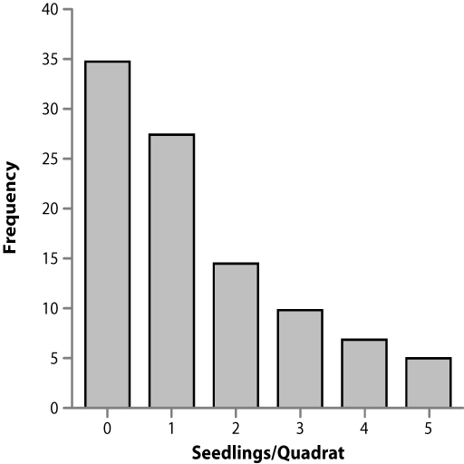

```{r setup, include=FALSE}
knitr::opts_chunk$set(echo = TRUE)
options("yaml.eval.expr" = TRUE)
```

# 1.3.Tablas y Gráficas  
Los seres humanos somos una especie mayormente visual, para la percepción del ambiente y la información producida por nosotros.  Por esto, un paso esencial en el análisis de datos, es la organización y representación de los datos en tablas y gráficas, de manera lógica y clara.  

En algunos libros y programas como Excel, se utiliza el término _chart_ para referirse a algunos tipos de de __gráficas__ _(graphs)_.  En los informes y trabajos científicos se utiliza un término más general: __figura__, el cual puede referirse a gráficas, dibujos esquemáticos, diagramas, y fotografías o imágenes.  

La creación de tablas, al igual que gráficas, debe seguir reglas de __claridad__, ser __concretas y completas__, y hacer __uso eficiente del espacio__.    

Toda figura o tabla debe tener una __leyenda__ explicativa de las mismas, describiendo las variables, unidades, estadísticas, et c., de manera tal que cualquier persona pueda interpretar la gráfica, imagen o tabla, sin necesidad de leer el texto del trabajo. Las figuras y tablas deben ser enumeradas de manera separada, a medida que se citan en el texto.  Las leyendas de las tablas se escriben en la parte superior de las mismas, mientras que las figuras llevan su leyenda en la parte de abajo.  Debo indicar que las gráficas __no__ llevan títulos en los informes o escritos científicos; pueden llevarlos en presentaciones o infografías.  

La decisión entre representar los datos en una tabla o una gráfica, depende de diversos factores, entre ellos la naturaleza de los datos y procedimientos estadísticos aplicadas, pero __no__ se deben presentar los mismos resultados en tablas y gráficas.  

***  

## 1.3.1.Gráficas con Datos Numéricos  
#### Objetivo  
__Construir gráficas que presenten datos de variables numéricas de manera clara y concisa__ 

En el libro de texto (Havel et al. 2019, cap. 3) pueden encontrar algunas reglas para crear buenas gráficas.

### Gráficas de Puntos _(scatterplot)_  

Se utilizan para representar la relación entre dos variables.  Cada variable está representada en un eje, llamados __eje x__ u __horizontal__, y __eje y__ o __vertical__.  Cuando hemos formulado una hipótesis sobre la relación causa-efecto entre las dos variables, el eje x representa la __variable independiente__ o __predictiva__, y el eje y, la __variable dependiente__ o __respuesta__.

#### __Ejemplos__   
Gráficas de datos de cactus _Melocactus intortus_ (melón de costa), en el Bosque Seco de Guánica.  

  

```{r scatterplot}
# activación de paquete de gráficas
library(ggplot2)
# cargar datos melocactus
melocactus <- read.csv("./data/melocactus.csv")
# gráfica de puntos
scpl <- ggplot(melocactus, aes(alturatotal, longinflo))
scpl + geom_point() +
  theme(axis.title=element_text(size=20,face="bold"), axis.text=element_text(size=12, face="bold")) +
  labs(x="Altura total, cm", y="Longitud de la inflorescencia, cm") +
  theme(axis.text=element_text(size=12),
        axis.title=element_text(size=14,face="bold"))
```

#### Figura 2.  Relación entre la altura total de la planta (cm) y la longitud de la inflorescencia (cm), en una población de _Melocactus intortus_ en el Bosque Seco de Guánica.
\

### Gráfica de Serie de Tiempo  
Se utilizan para representar los cambios a lo largo del tiempo (eje x) en una variable numérica (eje y).  


   

Usando R
```{r ts}
library(readxl)
covid_Austr <- read_excel("data/CoviD-19 Australia.xlsx")
p <- ggplot(covid_Austr, aes(x=date, y=contagiados)) +
  geom_line() + 
  xlab("")
p
```

#### Figura 4. Número de nuevos contagios con CoViD-19 por día, en Australia.


### Otros tipos de Gráficas
Hay otras opciones para representar datos numéricos, incluyendo:  

> gráficas de dos variables con __línea de regresión e intervalos de confianza__: para representar resultados de análisis de regresión.  
> gráficas de __tres variables__: con tres ejes o con dos ejes y símbolo proporcional a la tercera variable.    
> __coordenadas:__ para ubicación de individuos, pueden ser cartesianas o polares.      
\

[  __Home__](https://dsfernandez.github.io/bioestadisticas/index.html)

## 1.3.2.Tablas (o cuadros) 
#### __Objetivo__  
__Elaborar tablas siguiendo reglas de presentación de los datos__  

La mejor manera de producir tablas efectivas es buscando ejemplos en publicaciones científicas, y solicitando su revisión por personas con experiencia.  

En la parte superior de la tabla debe ir la leyenda descriptiva, empezando con la palabra __Tabla__ (o Cuadro) y el número consecutivo que le toque, de acuerdo al orden de  aparición en el escrito.  En la parte superior de cada columna de datos, deben ir los nombres de las variables y sus unidades, y en la columna de la izquierda, al inicio de cada fila (línea) usualmente van los casos, tratamientos o grupos diferentes.  Muy importante para una publicación:  __los datos numéricos en la tabla no deben acompañarse de las unidades__ (ver Ejemplo 3.2 en Havel et al. 2019).    

#### __Ejemplos__  
Tabla de datos de características de diversas marcas y modelos de automóviles:  
```{r tabla, message=FALSE, warning=FALSE}
# activar paquetes y cargar datos
library(kableExtra)
library(car)
data("mtcars")
# crear data frame
tabla <- mtcars[1:5, 1:4]
# construir tabla
tabla %>%
  kbl(caption = "Tabla 1.  Características mecánicas del motor de cinco modelos de automóbiles") %>%
  kable_classic(full_width = F, html_font = "Cambria")
```

La tabla anterior no presenta las unidades de los valores de cada variable.

```{r tablax}
# agregar unidades a las columnas (variables)
tabla <- setNames(tabla, c("mpg, miles/gallon", "cyl, number of cylinders", "disp, cubic cm", "hp, horse-power" ))
# construir nueva tabla
tabla %>%
  kbl(caption = "Tabla 1.  Características mecánicas del motor de cinco modelos de automóbiles") %>%
  kable_classic(full_width = F, html_font = "Cambria")
```

\ 

[  __Home__](https://dsfernandez.github.io/bioestadisticas/index.html)

## 1.3.3.Gráficas de Distribución de Frecuencias
#### __Objetivo__  
__Construir gráficas que muestren la cantidad o frecuencia de ocurrencia de datos de variables categóricas y numéricas__  

Una __distribución de frecuencias__ muestra un resumen del número de observaciones __(frecuencia)__ que se obtienen para valores específicos o rangos de valores.  Una distribución de frecuencias se puede representar en una tabla o en una gráfica; en esta sección trabajaremos con gráficas de distribución de frecuencias.  

### Frecuencias de categorías o variables discretas    

#### __Ejemplos__  

La frecuencia de casos de una variable categórica, usualmente se grafican mediante barras.

```{r cat-barras}
# cargar datos de archivo .Rdata
load("./data/Arthr.Rdata")
# gráfica de barras separadas
ggplot(Arthritis, aes(x=Treatment, fill=Improved)) +
     geom_bar(position="dodge")
```

#### Figura 5.  Efecto del tratamiento con una droga nueva, en pacientes con artritis, a los que se les suministró un placebo y una dosis de la droga.  

La frecuencia de casos para una variable numérica discreta, también se puede graficar mediante barras separadas.



Usando R
```{r frecdiscr}
maple <- read.csv("./data/Table 3.3.csv")
ggplot(maple, aes(Seedlings)) +
  geom_bar(fill = "#0073C2FF", width = 0.7) +
  labs(x="Número de plántulas por parcela", y = "Frecuencia")
```

__Figura 7.  Fecuencia de la cantidad de plántulas de _maple_ (arce) por parcela de un metro cuadrado.__

### Histogramas para distribución de frecuencia de variables numéricas continuas  

La representación de este tipo de datos es algo diferente a los anteriores, ya que la variable puede tomar cualquier valor, para obtener un valor de frecuencia es necesario agrupar los valores de la variable en __clases__ o contenedores _(bins)_.  Estas clases o _bins_ se grafican de forma contigua, según la definición de variable continua.  

La selección del intervalo de la clase, es algo arbitraria, pues depende de la cantidad de datos y de su amplitud de valores (o rango).  Usualmente se utilizan entre 8 y 12 clases o _bins_.  El valor central de una clase se denomina __marca de clase__, y su valor aparece en el eje de la variable continua.  

#### __Ejemplos__   

Histograma de la variable altura de la planta _Melocactus intortus_  
```{r histograma}
hist.melodata <- ggplot(melocactus, aes(alturatotal)) + 
  geom_histogram(binwidth=5, colour="white", fill="green") +
  labs(x="Altura total de la planta,cm", y = "Frecuencia")
hist.melodata
```

#### Figura 8.  Distribución de frecuencias de altura total de la planta (cm), en plantas de _Melocactus intortus_ del Bosque Seco de Guánica.  

Otra forma de presentar las frecuencias, es en forma acumulada:

  

Usando R
```{r frecacum}
frec_acum <- ggplot(data = melocactus, aes(x = alturatotal)) + 
    geom_histogram(aes(y = cumsum(..count..)), binwidth = 1, boundary = 0, color = "white", fill ="green") +
  labs(x="Altura total de la planta,cm", y = "Frecuencia acumulada")
frec_acum
```

#### Figura 10.  Frecuencia acumulada de altura total de la planta (cm), en plantas de _Melocactus intortus_ del Bosque Seco de Guánica.

\

[  __Home__](https://dsfernandez.github.io/bioestadisticas/index.html)

