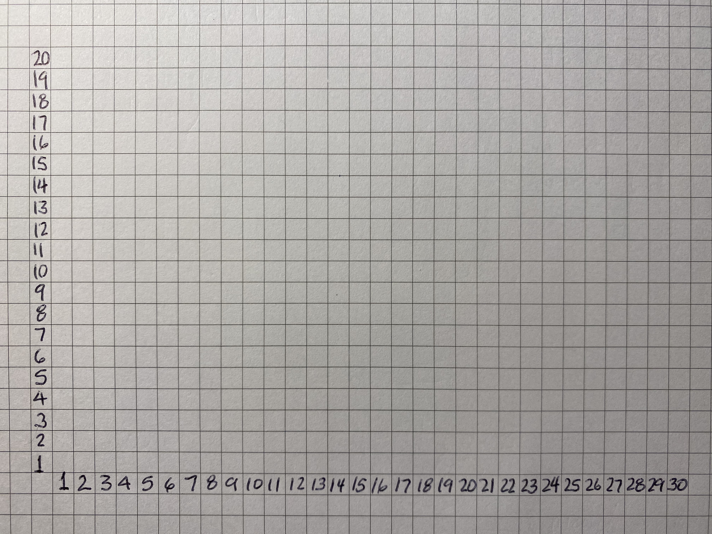

```{r setup, include=FALSE}
knitr::opts_chunk$set(echo = TRUE)
options("yaml.eval.expr" = TRUE)
```


# 1.1.Estadísticas

El estudio de la Biología requiere conocer las propiedades de los seres vivos, y la investigación científica incluye la medición de estas propiedades.  La o el investigador encontrará las siguientes situaciones:  

* no poder medir a todos los individuos de un grupo (población);    
* dos individuos, aunque sean de una misma especie, o tejido (si se trata de células), no son exactamente iguales.  

Esto conlleva al menos dos tareas para el/la investigador/a, si quiere llegar a una conclusión con la menor incertidumbre posible: (a) determinar una cantidad "representativa" de individuos de una población (muestra), y (b) estimar numéricamente la variabilidad entre los individuos.  

Vemos, entonces, que en el mundo real de los seres vivos (y de los componentes abióticos del mismo), la investigación científica se desarrolla en un marco de variación e incertidumbre.  Las estadísticas nos proveen las herramientas matemáticas para poder analizar esa variación e incertidumbre, y tratar de acercarnos a una interpretación de los datos, que permita establecer conclusiones o nuevas rutas de investigación.

*** 

## 1.1.1.¿Para qué estadísticas?
#### Objetivo
__Reconocer alguna aplicación de las estadísticas en la investigación biológica.__

#### __Actividades__  

_Discusión_ Los datos de la epidemia de Covid-19: incertidumbre en su análisis.

### ¿Para quiénes son las estadísticas?  

* Para los que usamos cualquier medio para ver o leer las noticias:
  + están cargadas de falacias (las tendencias, los falsos conflictos, teorías conspirativas);
  + entender las estadísticas nos hace algo escépticos, y nos permite filtrar conclusiones débiles (o falsas) 
 de las sólidas.  
* Para los que leen literatura científica (todo/as nosotro/as), en cualquier área.  
  + La encontramos en la organización y descripción de los datos.
  + En los modelos de regresión y multivariados, en los que se relacionan diversas variables y factores.
  + En los estudios epidemiológicos y de salud pública, para predecir futuras epidemias.
  + En las industrias de alimento y farmaceúticas, para garantizar la calidad con muestreos apropiados.  
* Para los que realizan investigación científica.  En este curso se van a familiarizar y trabajar con las estadísticas que se usan en el quehacer científico, incluyendo las __estadísticas descriptivas__, la __inferencia estadística__, y el __diseño de experimentos y observaciones__.
 
\ 
[  __Home__](https://dsfernandez.github.io/bioestadisticas/index.html)

*** 

## 1.1.2.Población y Muestra
#### Objetivo
__Reconocer la importancia de las muestras en las estadísticas__  

### ¿Cuántos peces hay en el océano?  

Varias especies de peces, usualmente pescados en grandes cantidades, han visto sus poblaciones disminuidas a niveles, que ya no se consideran comercialmente explotables.


¿Cómo podemos saber que está disminuyendo la cantidad de peces (al menos de algunas especies) en el océano?  No sería práctico ir en submarinos a contarlos.  Pero podemos obtener información de cuántos pescan por unidad de esfuerzo en los barcos pesqueros.  Esto nos ilustra el concepto de __población__ (todos los individuos de una especie en el océano), y una __muestra__ (la cantidad atrapada en una salida de un barco pesquero).

#### __Definiciones__  

[ __población__](https://online.upr.edu/mod/glossary/showentry.php?eid=5159)  

[ __muestra__](https://online.upr.edu/mod/glossary/showentry.php?eid=5161)

\ 
[  __Home__](https://dsfernandez.github.io/bioestadisticas/index.html)

***

## 1.1.3.Propiedades de una Buena Muestra
#### Objetivo  
__Reconocer y evitar los posibles errores o desviaciones en la selección de una muestra__   

Los estimados que podemos hacer a partir de una muestra van a depender de que esta sea representativa de la población de origen.  Sin embargo, sabemos de la incertidumbre que se produce en esa supuesta representatividad por las diferencias entre los individuos u objetos de la muestra. Dos conceptos nos ayudan a evaluar qué tan buena es una muestra:

> __Exactitud:__ una medida de cuán cerca estamos de un estimador representativo de la población (la media, por ejemplo)  
> __Precisión:__ una medida de cuánto se parecen los valores o mediciones de los individuos u objetos entre sí.

[ __exactitud__](https://online.upr.edu/mod/glossary/showentry.php?eid=5638)  
[ __precisión__](https://online.upr.edu/mod/glossary/showentry.php?eid=4997)    
  
La falta de __exactitud__ puede deberse a la toma de una __muestra sesgada__

[ __muestra sesgada__](https://online.upr.edu/mod/glossary/showentry.php?eid=5630) 

#### __Actividad__ 

_Discusión en grupo:_ Un amigo, que tiene árboles de aguacate, afirma que los aguacates de Puerto Rico son más grandes que los de la República Dominicana; concluye esto luego de comparar sus aguacates con los importados, que ha comprado en el supermercado.  
_Discuta con su grupo si mi amigo puede hacer esa afirmación o no, y por qué._  

#### __Ejercicio__  

Con los ejemplos del libro (1.3, 1.4), aplique el concepto de muestra sesgada.  Describa cómo se manifiesta en cada caso.  

__Example 1.3.__  _Snake Surveys from Road:_   Herpetologists sometimes estimate snake population  size by conducting road surveys where the snakes are  much easier to see. The number of snakes spotted crossing the road should be proportional to population size  and one might think that sex ratio could be determined  this way as well. However, biologists must be careful in  how they interpret such data, since this survey technique  is dependent on the activity levels of the snakes. For  instance, in the spring, nearly all snakes observed crossing the road are adult males. We could be tempted to  conclude that this population has very few females, when  in fact only the adult males are actively searching for  mates! The females are present in the population, but are  not fairly represented by this biased survey technique.  

__Example 1.4__  _Rabbit Growth Hormone:_  A large laboratory colony of rabbits was used as a source  of growth hormone, extracted from blood samples. A  lab assistant captured some of the rabbits, but didn’t  notice that young rabbits were easier to catch than older  rabbits. We now know that the concentration of growth  hormone declines with the age of the rabbit. The resulting extracts were higher in growth hormone than they  should have been. Only later did the scientist in charge  discover that he was obtaining a biased sample of  growth hormone measurements. 

_Referencia:_  Havel, John E.. Introductory Biological Statistics (p. 4). Waveland Press, Inc.. Kindle Edition.

La falta de __precisión__ puede resultar, usualmente, al tomar una muestra muy pequeña, y por azar se toman individuos u objetos con medidas extremas.

#### __Actividad__ 

_Discusión en grupo:_ En el siguiente ejemplo (también del libro anterior) indicar si hay un problema de exactitud o precisión.

__Example 1.2.__ _Salt Concentration:_  A chemistry instructor mixed a salt solution (NaCl) and  knows the correct concentration of salt, say 10.00 g per  liter. Suppose a student does three gravimetric determinations and finds the following answers: 9.50, 9.52, and  9.48 g per liter.  

\

[  __Home__](https://dsfernandez.github.io/bioestadisticas/index.html)  

***  

## 1.1.4.Muestra Aleatoria
#### Objetivo
__Aplicar una metodología para obtener muestras aleatorias__

#### __Definiciones__  

[ __muestra aleatoria__](https://online.upr.edu/mod/glossary/showentry.php?eid=5631)  
[ __independencia estadística__](https://online.upr.edu/mod/glossary/showentry.php?eid=5641)    
[ __muestra aleatoria estratificada__](https://online.upr.edu/mod/glossary/showentry.php?eid=5633)   

### Método general para obtener una muestra aleatoria simple  

> 1. Asignarle un número entero a cada unidad (individuo o posición) en la población (1, 2, 3, ..., N)  
> 2. Decidir cuántas unidades serán colectadas por muestra.  El tamaño de esta muestra será n.  
> 3. Utilizar un método para generar números al azar entre 1 y N.  [Uso de Tabla de Números Aleatorios](https://drive.google.com/file/d/1mmLwxjTmGucnOENPYk3gP1e1-h3HETzY/view?usp=sharing) o mediante computadora.
> 4. Tomar las unidades que corresponden a los números generados.  Estos individuos serán los medidos o tratados en esa muestra.  

#### __Ejercicios__  

_Selección de estudiante para presentar:_ Quiero seleccionar al azar dos estudiantes para realizar una presentación.  Utilizando la lista de estudiantes, ordenada alfabéticamente, asignamos un número a cada individuo.  Vamos a usar un generador de números al azar de R (¿es realmente al azar?) para obtener dos números del conjunto de estudiantes numerados.  
```{r}
# función sample con parámetros (min:max, n, reemplazo)
sample(1:30, 2, replace = F)
```

¿Qué puede ocurrir si _replace = T_?  
\

_Selección de plantas en una siembra:_  De una siembra de girasoles queremos tomar una muestra aleatoria de 30 plantas, para un análisis de los aceites de las semillas.  


Como es una siembra con distribución regular de las plantas, podemos construir un mapa de la ubicación de cada planta, en el que cada cuadrito representa una planta:  



Generamos 30 pares de números que representan las coordenadas X-Y de cada planta en el mapa:
```{r}
# coordenada X
coor.x <- sample(1:30, 30, replace = T)
# coordenada Y
coor.y <- sample(1:20, 30, replace = T)
# unimos las coordenadas
coord.girasol <- data.frame(coor.x, coor.y)
coord.girasol
```

¿Por qué utilizamos _replace=T_?
¿Se pueden producir coordenadas repetidas?  
\

[  __Home__](https://dsfernandez.github.io/bioestadisticas/index.html)

