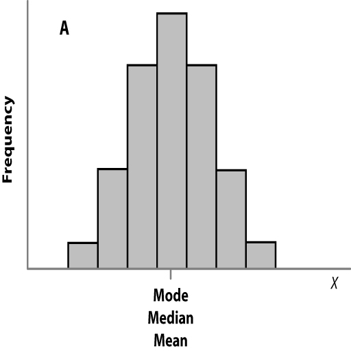

```{r setup, include=FALSE}
knitr::opts_chunk$set(echo = TRUE)
options("yaml.eval.expr" = TRUE)
```

# 1.4.Estadísticas Descriptivas: Medidas de la Tendencia Central y de Dispersión de los Datos
Al medir alguna característica (variable) en individuos de una población (o muestra generalmente), usualmente encontraremos que hay diferencias en los valores obtenidos.  En esta sección del curso conoceremos algunas maneras de encontrar medidas de la tendencia central de las variables, y de la variación entre los individuos.


## 1.4.1.Parámetros Poblacionales y de la Muestra  
#### Objetivo
__Diferenciar parámetros y estadísticos, en el lenguaje de las estadísticas__  

Con las mediciones que realizamos en una muestra, podemos calcular algunos aspectos de la tendencia central y variación entre individuos; estos valores se denominan __estadísticos__, y permiten estimar los valores de la tendencia central y la dispersión en la población, los que en este caso se denominan __parámetros poblacionales__.  

### Parámetros y estadísticos  

A continuación una lista de algunos parámetros y estadísticos de uso común:  

> | medida | parámetro | estadístico | 
> |-------|:-----:|:-----:|
> | media | $\mu$ | $\bar X$ |   
> | mediana | $\theta$ | $M$ |  
> | varianza | $\sigma^2$ | $s^2$ |  
> | desviación estándar | $\sigma$ | $s$ | 
> | proporción | $p$ | $\hat p$ |  

\  

[  __Home__](https://dsfernandez.github.io/bioestadisticas/index.html)

## 1.4.2.Medidas de la Tendencia Central  
#### Objetivos  
__Conocer los estadísticos que describen la tendencia central__  

La __tendencia central__ de una muestra (o población) es el valor alrededor del cual se agrupan las observaciones o mediciones de una variable.  Existen varios estadísticos para describirlas, y su selección depende del tipo de variable y la distribución de los datos.  

### Proporción  
Se refiere a la __fracción__ de individuos o casos en una muestra, que tienen alguna característica (o nivel de una variable categórica).  
Si _x_ es el número de observaciones de interés y _n_ el tamaño de la muestra, entonces la proporción observada será:
$$\hat p = \frac{x}{n}$$
A menudo las proporciones se convierten a porcentajes _(%)_ multiplicando por 100.  

#### __Ejemplo__  
A partir de los resultados de una encuesta vamos a calcular la proporción de estudiantes que viven en Humacao.  
```{r proporcion}
# individuos que cumplen la condición
x <- 7
# total de individuos en la muestra
n <- 29
# proporción
p <- x / n
# porcentaje
pciento <- p * 100
# resultados
resulta <- data.frame(x, n, p, pciento)
colnames(resulta) <- c("en Humacao", "Total", "proporción", "%")
resulta
```

### Moda  
Es otra manera de describir la tendencia central de una variable categórica.  La __moda__ es el valor más común de unos datos.  Para determinar la moda no es necesario un cálculo especial, la moda se identifica; una manera de obtenerla es observar una gráfica de  barras de frecuencias o un histograma (para variables continuas).  A continuación tiene una función para identificar la moda en números y caracteres.  

#### __Ejemplo__  
Moda de los datos de edad de la clase.  

¿Cúal es la diferencia entre moda y proporción?

```{r moda}
# tomado de: tutorials-point
# crear la función
getmode <- function(x) {
   uniqv <- unique(x)
   uniqv[which.max(tabulate(match(x, uniqv)))]
}
# vector con números
v <- c(2,1,2,3,1,2,3,4,1,5,5,3,2,3)

# identificación de la moda
result <- getmode(v)
print(result)

# vector con texto
charv <- c("o","it","the","it","it")

# identificación de la moda
result <- getmode(charv)
print(result)
```

### Mediana  
En una lista ordenada de valores numéricos, la __mediana__ es el valor que divide de manera igual, por arriba y por abajo, la cantidad de valores de la variable.  

Cuando el número de datos es impar, el valor de la mediana es uno de los datos, aquel que divide en partes iguales la secuencia de datos.  Cuando el número de datos es par, los dos valores centrales se promedian, para obtener la mediana:  

> _caso 1:_ &nbsp;  2, 2, 2, __3__, 3, 4, 4 &nbsp; &nbsp; M = 3    

> _caso 2:_ &nbsp; 2, 2, 2, __3, 4__, 4, 4, 4 &nbsp; &nbsp; M = 3.5   

> _caso 3:_ &nbsp; 2, 2, 2, __3, 4__, 10, 100, 1000  &nbsp; &nbsp;  M = 3.5  

```{r}
# mediana caso 1
mediana1 <- median(c(2, 2, 2, 3, 3, 4, 4))
# mediana caso 2
mediana2 <- median(c(2, 2, 2, 3, 4, 4, 4, 4))
# mediana caso 3
mediana3 <- median(c(2, 2, 2, 3, 4, 10, 100, 1000))
medianas <- data.frame(mediana1, mediana2, mediana3)
colnames(medianas) <- c("Caso 1", "Caso 2", "Caso 3")
medianas
```

\ 

[  __Home__](https://dsfernandez.github.io/bioestadisticas/index.html)  

### Media  
La __media__ es el promedio aritmético de un conjunto de datos numéricos.  Si realizamos la medición de todos los individuos de una población y calculamos la media, obtendremos la verdadera __media poblacional__ ($\mu$).  Si las mediciones son en una muestra de la población y calculamos la media, obtendremos la __media muestral__ ($\bar X$).  

La fórmula de la media, para un conjunto de valores $x_1,\ x_2,\ x_3,...,\ x_n$, será:  
$$\bar X = \frac{\sum x}{n}$$  

es decir, la suma de todos los valores, dividido entre la cantidad de valores de la muestra.  

La función de R para calcular la media en __mean(x)__, donde __x__ es un vector de datos de una variable.

### Media ponderada   
En algunos casos los datos numéricos discretos están organizados como una distribución de frecuencia (ver Figura 7 del tema Gráficas y Tablas).  En estos casos usamos lo que se conoce como una __media ponderada__ _(weighted mean)_, y su fórmula es la siguiente:  
$$\bar X_w = \frac{\sum fx}{\sum f}$$

La media ponderada se usa cuando diferentes medidas tienen diferentes pesos o niveles de importancia.  Un ejemplo conocido es el cálculo de "promedio" o _GPA_. 

#### __Ejemplo__
J. Picachú tiene las siguientes notas luego de su primer año en la universidad:  
```{r notas, echo=FALSE, message=FALSE, warning=FALSE}
library(readxl)
notas <- read_excel("./data/notas.xlsx")
notas
```
Para usar el promedio ponderado primero debemos calcular la cantidad de créditos por nota __(f)__:
```{r creditos, echo=FALSE}
frecuencia <- read_excel("./data/notas.xlsx", 
    sheet = "ponderado")
frecuencia
```
Ahora podemos calcular el promedio ponderado, o _GPA_ para este caso:
```{r GPA}
GPA <- sum(frecuencia$f * frecuencia$valor_nota) / sum(frecuencia$f)
GPA
```

### Comparación entre la moda, la mediana y la media    
Según sea la distribución de frecuencias de los valores de una muestra, la moda, la mediana y la media podrán estar muy cerca o separadas una de otra.

  
__Figura 1. Histograma mostrando una distribución simétrica de la frecuencia de valores de los datos.__  

  
__Figura 2. Histograma mostrando una distribución asimétrica o sesgada de la frecuencia de valores de los datos.__  

\ 

[  __Home__](https://dsfernandez.github.io/bioestadisticas/index.html)

## 1.4.3.Medidas de Dispersión    

### Rango o ámbito

### Cuantiles, cuartiles y sus distancias

### Varianza, desviación estándar y error estándar 

### Coeficiente de variación  


\ 

[  __Home__](https://dsfernandez.github.io/bioestadisticas/index.html)

