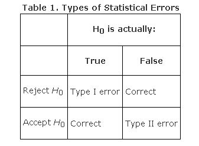

```{r setup, include=FALSE}
knitr::opts_chunk$set(echo = TRUE)
options("yaml.eval.expr" = TRUE)
```

# 2.1.Inferencia Estadística y Prueba de Hipótesis 

#### __Definiciones__ 
Ver definiciones en el libro, y las siguientes entradas en el glosario del curso:  

* [ __Inferencia Estadística__](https://online.upr.edu/mod/glossary/showentry.php?eid=5523)  
* [ __Estimación Estadística__](https://online.upr.edu/mod/glossary/showentry.php?eid=6376)  
* [ __Prueba de Hipótesis__](https://online.upr.edu/mod/glossary/showentry.php?eid=7510)  


## 2.1.1.Hipótesis Estadísticas  
#### Objetivos  
__Construir hipótesis que puedan ser probadas estadísticamente__  

La observación de un fenómeno en el mundo biológico es usualmente muy interesante, pero cuando tratamos de explicarlo es cuando realmente estamos haciendo un trabajo científico.  Es aquí donde interviene la formulación de una hipótesis adecuada.  

#### __Definiciones__  

* [ __Hipótesis__](https://online.upr.edu/mod/glossary/showentry.php?eid=7541)  
* [ __Teoría__](https://online.upr.edu/mod/glossary/showentry.php?eid=7542) 

#### __Ejercicios__  
Elaborar hipótesis formales sobre un tema asignado, partiendo de una pregunta y planteando una premisa y una predicción, y que pueda ser comprobada mediante observaciones y/o experimentación.

### Hipótesis Estadísticas  
Para probar una hipótesis de manera estadística, debemos primero convertir la hipótesis formal en un par de hipótesis mutualmente excluyentes: la __hipótesis nula__, que se representa $H_0$, y la __hipótesis alterna__, que se representa $H_a$ (o con un número, $H_1$).  Solamente la $H_0$ es la que se prueba directamente mediante estadísticas, y en un experimento representa la falta de efecto por parte de los tratamientos o condiciones experimentales; también puede representar lo esperado según un modelo probabilístico (Normal, Poisson, et c.).  

#### __Ejemplos__  
En el libro de Havel _et al._ (2019): Table 6.2 Some Examples of Null and Alternative Hypotheses.   
\

Toda hipótesis nula genera una distribución de probabilidades, y cualquiera que sea esta distribución, está asociada a la hipótesis nula.  La hipótesis alterna es todo aquello que no sea la hipótesis nula, y son mutuamente excluyentes.  Es decir si una es correcta la otra no puede serlo, y entre ambas se cubren todas las posibilidades.  

#### __Ejemplos__
Ver ejemplos anteriores para la distribución binomial y de Poisson.

\

[  __Home__](https://dsfernandez.github.io/bioestadisticas/index.html)

## 2.1.2.Decisiones Estadísticas y Potenciales Errores  
#### Objetivos  
__Conocer las probabilidades de rechazar la hipótesis nula y la de equivocarnos__  

En el ejemplo 5.7 del libro, observamos que la probabilidad de que una pareja heterocigota recesiva, tenga sus tres hijos con fibrosis cística (FC) es de 0.0156; podemos decir que en 100 parejas heterocigotas del alelo FC, con tres hijos, esperamos que entre una y dos parejas tengan los tres hijos con FC.  

Ahora bien, si en 15 parejas heterocigóticas, de un total de 100 con tres hijos, los tres tienen FC, ¿será algo que puede ocurrir al azar, según las reglas de la genética clásica? O, ¿existirán otros factores que determinan la FC en la población de la cual se obtuvo la muestra?  Y si fueran 3 de 100, ¿es suficiente para rechazar que hay una segregación al azar de los alelos?  

Con la información anterior podemos formular las siguientes hipótesis estadísticas:
$$H_0 : parejas\ con\ tres\ hijos\ con\ FC \leq 2$$
para el caso de que sea un proceso puramente aleatorio de segregación de alelos y herencia simple.  
$$H_a : parejas\ con\ tres\ hijos\ con\ FC > 2$$  
para el caso en que intervengan otros factores, además de la genética Mendeliana.  

Mediante la función binomial, podemos calcular la probabilidad _(p(x))_ de que el evento "tres hijos con FC" _(p = 0.0156)_ ocurra en _x_ número de parejas, en contraposición a los otros eventos _(q = 0.9844)_ posibles (0, 1, o 2 hijos con FC), de un total de 100 parejas heterocigotas recesivas de tres hijos _(k)_: 

```{r pbin}
# para x = 15
tresFC <- dbinom(15, size = 100, prob = 0.0156)
sprintf("probabilidad de tres hijos con FC en 15 de 100 parejas = %.2e", tresFC)
# para x = 3
tresFC <- dbinom(3, size = 100, prob = 0.0156)
sprintf("probabilidad de tres hijos con FC en 3 de 100 parejas = %.4f", tresFC)
# para x = 2
tresFC <- dbinom(2, size = 100, prob = 0.0156)
sprintf("probabilidad de tres hijos con FC en 2 de 100 parejas = %.4f", tresFC)
# para x = 1
tresFC <- dbinom(1, size = 100, prob = 0.0156)
sprintf("probabilidad de tres hijos con FC en 1 de 100 parejas = %.4f", tresFC)
```

Los resultados muestran una probabilidad muy baja de que 15 parejas de 100, con tres hijos con FC, se dé de forma aleatoria, asumiendo que la hipótesis nula de que se cumple con la genética mendeliana solamente.  Por otra parte, encontrar tres parejas de 100, no tiene una baja probabilidad de ocurrencia (en comparación con lo esperado, una o dos parejas) asumiendo que solo actúa la genética mendeliana y el azar.

```{r binom}
parejas <- 0:15
plot(parejas,dbinom(parejas,size=100,prob=.0156),
     type='h',
     ylab='Probabilidad',
     xlab ='Número de parejas',
     lwd=3)
```

__Figura 1.__ Distribución de probabilidades binomiales para diferentes números de parejas con tres hijos con FC (p = 0.0156), de un total de 100 parejas heterocigóticas recesivas para FC. 

Los resultados en la gráfica nos muestran que a medida de que el valor observado/medido se aleja de lo más esperado (que sería la $H_0$), la probabilidad de que ocurra un mayor número de parejas con tres hijos con FC es menor, y en valores extremos (15 parejas) es extremadamente baja. Si nuestra medición es confiable, podemos pensar que la $H_0$ no se sostiene en este último caso, y la $H_a$ puede ser la alternativa.

### Valor de probabilidad _(p-value)_ y nivel de significancia de la prueba ($\alpha$)  

El valor anterior de probabilidad para 15 parejas con hijos con FC, es la probabilidad en esta prueba y con esta distribución de probabilidades, de obtener un valor extremo, asumiendo que la hipótesis nula es correcta, y es lo que encontraremos en las pruebas estadísticas como __p-value__ (en R a veces como Pr).  

Pero ¿cuán baja debe ser esa probabilidad para poder decir que nuestra medición no se ajusta o rechaza la hipótesis nula al alejarse mucho de esta?  En muchos procedimientos estadísticos, la probabilidad para aceptar o rechazar la $H_0$ es 0.05 o 0.01.  A esta probabilidad se la conoce como el __nivel de significancia__ o $\alpha$.  Este valor de probabilidad debe establecerse al inicio de nuestra investigación, para no entrar en decisiones sesgadas al momento de aceptar o rechazar $H_0$, como veremos a continuación.  

### Dificultades en la Decisión sobre la $H_0$  

El rechazo de $H_0$ al obtener un valor de _p_, puede llevarnos a conclusiones contradictorias si no establecemos de antemano un valor de $\alpha$ adecuado al tipo de estudio o procedimiento estadístico con el que estamos trabajando.  Por ejemplo si obtenemos un valor de _p = 0.02_, podemos rechazar la $H_0$ si $\alpha = 0.05$, pero no si establecemos un $\alpha = 0.01$ .  Por esto es importante siempre reportar el valor de _p_, y no solamente indicar si se rechazó o no la $H_0$ .  

Lo anterior nos muestra una de las características que más nos dificulta el manejo de las estadísticas en nuestro quehacer en las ciencias: la omnipresencia de la incertidumbre.  

\

[  __Home__](https://dsfernandez.github.io/bioestadisticas/index.html)

### Errores Tipo I y Tipo II  

Mediante las pruebas estadísticas tomamos la decisión de aceptar o rechazar la $H_0$, y por otra parte esta puede ser verdadera o falsa. Por lo tanto hay cuatro posibles situaciones, dos correctas y dos incorrectas.  

  

Cuando se rechaza la $H_0$ y esta es verdadera, cometemos un __error Tipo I__, y su riesgo lo determina el valor de __$\alpha$__, el cual se establece antes de realizar la prueba.  Un __error Tipo II__ lo cometemos cuando fallamos en rechazar la $H_0$ cuando esta es en realidad falsa.  La probabilidad de este tipo de error se denomina __$\beta$__.  

A continuación un ejemplo más concreto de lo que estamos describiendo, para el caso de una __hipótesis nula de negatividad__ para un ensayo clínico:  

  
__Figura 2.__  Ilustración de los errores Tipo I y Tipo II, para una $H_0$: prueba negativa de embarazo.

### Poder de la Prueba  

Se denomina __poder de la prueba__ a la probabilidad de poder rechazar una hipótesis nula falsa, y su valor es $1- \beta$.  El valor de $\alpha$ lo seleccionamos de antemano, pero $1-\beta$ no lo conocemos de antemano, y está influenciado por los siguientes factores:  

1. el error Tipo I $(\alpha)$    
2. la diferencia entre los estadísticos (media por ejemplo) que queremos discriminar; a esta diferencia también se la conoce como __tamaño del efecto__ $(\delta)$; y  
3. el tamaño de la muestra  

  
__Figura 3.__  Ilustración de cómo al variar $\alpha$ cambia el valor de $\beta$, y el poder de la prueba, $1 - \beta$.   

\

[  __Home__](https://dsfernandez.github.io/bioestadisticas/index.html)

## 2.1.3.Pruebas de Hipótesis: alguna terminología para recordar  
#### Objetivos  
__Conocer el significado de la terminología y conceptos para realizar pruebas de hipótesis estadísticas__  

### Términos claves para recordar  

* nivel $\alpha$  
* hipótesis alterna, $H_a$  
* probabilidad $\beta$  
* valor crítico del estadístico de la prueba  
* prueba de hipótesis  
* hipótesis nula, $H_0$  
* valor p, _p-value_ o _Pr_  
* poder de la prueba, $1 - \beta$  
* estadísticamente significativo  
* inferencia estadística  
* prueba estadística  
* teoría  
* hipótesis formal  
* error tipo I  
* error tipo II  

### Efecto o diferencia significativa  

Usualmente empleamos el término "significativo" para referirnos al resultado de una prueba, que nos permite rechazar la $H_0$ con a un nivel $\alpha$ predeterminado.  Es importante señalar que lo significativo es dentro del contexto de la prueba estadística (estadísticamente significativo), ya que la palabra significativo tiene otras acepciones, como llamativo, por ejemplo. 

### Pasos para Completar una Prueba de Hipótesis  
__Box 6.2__ del libro de Havel _et al._ (2019)    

1.    Establecer claramente la __pregunta__ o __predicción__ que se quiere responder o probar.  
2.    ¿Cuál __distribución__ describe el tipo de __muestras__ obtenidas?  Algunos ejemplos:   
    a.    probabilidades: distribución binomial  
    b.    contaje en tiempo o espacio: distribución de Poisson  
    c.    medias muestrales: distribución normal  
3.    ¿Cuál es la __prueba estadística__ apropiada?  
4.    Formular las __hipótesis nula__ $H_0$ y __alterna__ $H_a$.  
5.    Establecer el __nivel__ $\alpha$ al cual o debajo del cual rechazar $H_0$.  
6.    Calcular el __estadístico__ correspondiente, de la prueba, usando la(s) muestra(a).  
7.    Calcular el __valor__ apropiado de __p__ del estadístico de la prueba, usando una tabla o programa estadístico.  
8.    Tomar una __decisión__ acerca de $H_0$, al comparar $\alpha$ y el __valor de p__.  Por ejemplo, si __p__ es menor o igual a $\alpha$, rechazar $H_0$.  
9.    __Interpretar__ la decisión, a la luz de la pregunta o hipótesis formal original.      

\


[  __Home__](https://dsfernandez.github.io/bioestadisticas/index.html)

