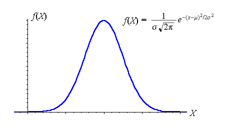
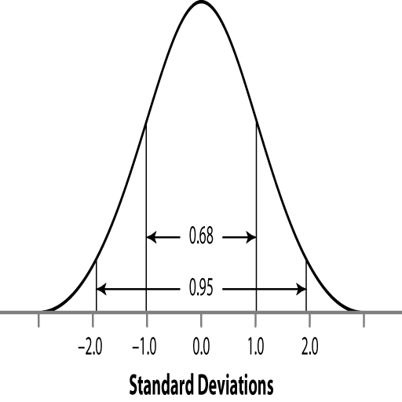

```{r setup, include=FALSE}
knitr::opts_chunk$set(echo = TRUE)
options("yaml.eval.expr" = TRUE)
```

# 2.3.La Distribución Normal  

La __distribución normal__ es una distribución de frecuencias de variables continuas, que tiene forma de campana (simétrica) y muchas aplicaciones en pruebas estadísticas, que estaremos estudiando más adelante (prueba t, ANOVA, análisis de regresión).  También la podemos aplicar directamente para estimar la probabilidad de que ocurran ciertos valores en las medidas de una muestra.

## 2.3.1.Propiedades de la Distribución Normal  
#### Objetivos  
__Conocer las características y propiedades de la distribución normal__  

La distribución normal formalmente se especifica por medio de una __curva de densidad normal__ (o de Gauss) que describe la densidad de probabilidades en la distribución de valores de observaciones (muestra) de una variable aleatoria, cuando el número de observaciones es grande (> 30, usualmente).  Se aplica a muchas de las variables usualmente medidas en biología, aunque hay otras curvas de distribución de densidad, con formas parecidas a la normal (tipo campana), por ejemplo la __t de Student__.  

La curva de densidad normal se expresa formalmente como:  
$$f(x) = \frac{1}{\sigma \sqrt{2 \pi}}e^{(\frac{-(x - \mu)^2}{2\sigma^2})}$$ 
dónde $\mu$ es la media poblacional (o su estimado), y $\sigma$ la desviación estándar.  En realidad a un valor puntual de _x_ no le corresponde un valor de probabilidad, ya que ésta está definida como el área bajo la curva (densidad x $\Delta x$), y un solo punto no determina un área, sino una línea.  

  

### La curva normal y datos reales  
Cuando realizamos mediciones de una variable continua, como longitud y masa, usualmente esperamos una distribución de frecuencias de valores que se asemeje a la distribución normal, especialmente si es una muestra grande, y no tenemos evidencia de algún sesgo en la medición.  

#### __Ejemplo__  
Tenemos datos de la masa de 487 semillas de la especie _Thespesia populnea_ (emajagüilla), y a continuación podemos ver el histograma de la variable masa, en gramos:  
```{r norm, message=FALSE, warning=FALSE}
#histograma para masa de semillas de Thespesia populnea
# datos
library(readxl)
library(dplyr)
library(ggplot2)
semillas <- read_excel("data/masa_semilla_thepol.xlsx", 
    sheet = "masa")
# gráfica de histograma
m_sd <- semillas %>%
  summarise(means = mean(masa_g), sd=sd(masa_g))
ggplot(semillas, aes(x=masa_g)) +
  geom_histogram(aes(y=..count..), position="identity", binwidth=.02, color="blue", fill="gray") +
  labs(x="Masa de semilla, g", y="frecuencia")
```    
__Figura 1__. Histograma de frecuencias de valores de masa (g) de semillas de _T. populnea_ (_n_ = 487).  

A continuación podemos observar si la distribución de frecuencias de los datos se ajustan a la curva de densidad normal con los valores de media (0.224) y desviación estándar (0.052) de la muestra.  

```{r}
# gráfica con curva de densidad normal
m_sd <- semillas %>%
  summarise(means = mean(masa_g), sd=sd(masa_g))
ggplot(semillas, aes(x=masa_g)) +
  geom_histogram(aes(y=..density..), position="identity", binwidth=.02, color="blue", fill="gray") +
  stat_function(fun = dnorm, color="red", size=1, args=list(mean=m_sd$means, sd=m_sd$sd)) +
  labs(x="Masa de semilla, g", y="densidad")
```  
__Figura 2__.  Histograma de frecuencias de valores de masa (g) y curva de densidad normal con $\mu$ = 0.224 y $\sigma$ = 0.052, de semillas de _T. populnea_ (_n_ = 487).  

La correspondencia entre datos y la curva no es exacta; más adelante estaremos realizando pruebas para determinar si la desviación de los datos con respecto a la distribución normal es significativa con cierto nivel de probabilidad.   

### Area bajo la curva - proporción y probabilidad  

Como pudimos observar en la función de densidad normal, la curva está definida por la media ($\mu$) y la desviación estándar ($\sigma$), lo cual determina que exista una relación fija entre la desviación estándar y la proporción de área bajo la curva, que ocurre entre $\mu$ y un valor de $\sigma$, o entre valores de $\sigma$.  A continuación podemos observar valores notables de probabilidades (o proporción de la muestra) para ciertos valores de $\sigma$:  

  

__Figura 3__.  Areas de probabilidad o proporción bajo la curva de distribución normal estándar ($\mu = 0, \sigma = 1$), para algunos valores de $\sigma$.  

La imagen anterior nos muestra la proporción de valores o probabilidades de ocurrencia (área) que hay debajo de la curva y entre 1 y 2 veces la desviación estándar.  Por ser una función simétrica, podemos decir que entre la media y 1 o 2 veces la desviación estándar, tendremos la mitad de la probabilidad o proporción de valores.  

#### __Ejercicio__  
¿Cuál es la proporción de valores entre +1$\sigma$ y -2$\sigma$?

\

[  __Home__](https://dsfernandez.github.io/bioestadisticas/index.html)

## 2.3.2.Transformación Z y Aplicaciones  
#### Objetivos  
__Aplicar la distribución normal estándar a problemas de probabilidades y proporciones de una muestra__

En la Figura 3 se indica que se trata de una curva de __distribución normal estándar__ porque tiene una media de 0 y una desviación estándar de 1.  Esta curva sirve de referencia para el cálculo de las probabilidades o proporción de valores entre puntos de $x$ o valores de $\sigma$, mediante tablas que tienen los cómputos del área (proporción) entre esos valores.  Pero para usar esas tablas debemos antes convertir nuestra supuesta distribución normal, con su valor de media y desviación estándar, a una distribución normal estándar, para esto transformamos los valores incluidos en nuestra distribución ($x$) a valores denominados _z-scores_ (puntuación z), mediante la siguiente fórmula:  
$$z = \frac{x - \mu}{\sigma}$$  
dónde $\mu$ y $\sigma$ son las media y desviación estándar de nuestra muestra, y asumiendo que ésta es representativa de la población de valores.    

Con el _z-score_ podemos calcular las probabilidades o proporciones (áreas) antes o después de algún valor de _z_, o entre la media y _z_, o entre dos valores de _z_.  

  

__Figura 4__.  Probabilidad o proporción de valores, antes (a la izquierda) del valor _z_ calculado a partir de nuestra muestra.  

  

__Figura 5__.  Probabilidad o proporción de valores a la izquierda y derecha de la media, para los correspondientes valores de _z_. 

### Tablas para la Distribución Normal Estándar  
> Para obtener valores de _z_ o de _P_

Para obtener las áreas bajo la curva (probabilidad o proporción de valores) a la izquierda de valores de _z_ podemos utilizar la tabla disponible en los recursos de la clase: [Tabla distribución normal izquierda z-score](https://drive.google.com/file/d/1oyh1qDsng2BEVe01tkkOWHfkQoPmPj9O/view?usp=sharing).  Para obtener las áreas bajo la curva desde la media a valores de _z_ podemos utilizar la tabla que trae el libro de Havel _et al._ (2019), _Appendix A, Table A.1_.  

#### __Ejemplo__  
Para una muestra de 487 semillas de la especie _Thespesia populnea_ la longitud ápice-base de las semillas tiene una $\mu$ = 10.15 mm y una $\sigma$ = 1.60 mm.  Asumiendo una distribución normal, ¿cuántas semillas tienen una longitud mayor de 11 mm?  

Para poder consultar la tabla de proporciones de la distribución normal estándar, primero debemos calcular el valor de _z_ para 11 mm:  
$$z = \frac{11 - 10.15}{1.60} = 0.53125$$  

Consultando la tabla podemos obtener un valor de probabilidad o proporción _P_ a la izquierda de 11; como la tabla solo provee dos decimales para el valor _z_, podemos interpolar utilizando la siguiente fórmula:
$$P_{interp.} = \frac{(z_{calc.} - z_{abajo})(P_{arriba} - P_{abajo})}{z_{arriba} - z_{abajo}} + P_{abajo}$$
El valor de _P_ interpolado es de 0.70237, es decir que el 70.237% de las semillas son de una longitud menor o igual a 11 mm; como el problema nos pide la proporción mayor de 11 mm, debemos calcular 1 - 0.70237 = 0.29763, es decir: 29.763 % de las semillas tienen una longitud mayor de 11 mm.  

Utilizando R podemos trabajar el problema de la siguiente manera:
```{r zprob}
# proporción para media y desviación estándar conocidas
psem <- pnorm(11, mean = 10.15, sd = 1.60, lower.tail= FALSE)
sprintf("Proporción de semillas con longitud mayor de 11 mm = %.3f", psem)
```  
Para calcular el valor de _z_ (y de la variable estudiada) que corresponde a una probabilidad o proporción _P_, podemos utilizar la tabla y realizar la interpolación correspondiente.  Luego utilizamos la fórmula de _z_ y calculamos el valor _x_ de nuestra variable.  

Otra alternativa, mediante R:  
```{r pz}
# valor correspondiente a una P de la distr. normal
valor <- qnorm(0.29763, mean = 10.15, sd = 1.60, lower.tail = FALSE)
sprintf("Longitud de semillas para separar el 29.76%% más grandes = %.3f", valor)
```

\

[  __Home__](https://dsfernandez.github.io/bioestadisticas/index.html)

## 2.3.3.Distribución y Error Estándar de la Media Muestral  
#### Objetivos
__Reconocer algunas propiedades de las muestras de una población__  

En la __Figura 2.__ observamos la distribución de la variable masa de 487 semillas de _T. populnea_, y encontramos que no parece ajustarse a la distribución normal correspondiente a $\bar X = 0.224$ y $s = 0.052$.  Vamos a tomar muestras aleatorias (1000) de esta "población" de semillas, y observar cómo se distribuyen las medias de cada muestra, para diferentes tamaños de muestra.  Calcularemos la media y la desviación estándar en cada caso.      


```{r centralt}
# 1000 muestras de n = 4
samples <- replicate(1000, sample(semillas$masa_g, 4, replace = TRUE))
# media y suma de columnas (muestras)
sample_means <- colMeans(samples)
sample_sums <- colSums(samples)
# media y sd de las medias muestrales
mx <- mean(sample_means)
smx <- sd(sample_means)
# data frame para ggplot
sample_stats <- data.frame(sample_means, sample_sums)
# histograma y curva normal ajustada
ggplot(sample_stats, aes(x=sample_means)) +
  geom_histogram(aes(y=..density..), position="identity", binwidth=.01, color="blue", fill="gray") +
  stat_function(fun = dnorm, color="red", size=1, args=list(mean=mx, sd=smx)) +
  labs(x="Masa de semilla, g", y="densidad")
sprintf("Media de las muestras (n = 4) = %.4f", mx)
sprintf("Desv. Est. de la media muestral (n = 4) = %.4f", smx)
```  
__Figura 6a.__ Histograma de frecuencias de valores de masa (g) de semillas y curva de densidad normal de las medias muestrales para n = 4.  

```{r centraltt, echo=FALSE}
# 1000 muestras de n = 12
samples <- replicate(1000, sample(semillas$masa_g, 12, replace = TRUE))
# media y suma de columnas (muestras)
sample_means <- colMeans(samples)
sample_sums <- colSums(samples)
# media y sd de las medias muestrales
mx <- mean(sample_means)
smx <- sd(sample_means)
# data frame para ggplot
sample_stats <- data.frame(sample_means, sample_sums)
# histograma y curva normal ajustada
ggplot(sample_stats, aes(x=sample_means)) +
  geom_histogram(aes(y=..density..), position="identity", binwidth=.006, color="blue", fill="gray") +
  stat_function(fun = dnorm, color="red", size=1, args=list(mean=mx, sd=smx)) +
  labs(x="Masa de semilla, g", y="densidad")
sprintf("Media de las muestras (n = 12) = %.4f", mx)
sprintf("Desv. Est. de la media muestral (n = 12) = %.4f", smx)
```
  
__Figura 6b.__ Histograma de frecuencias de valores de masa (g) de semillas y curva de densidad normal de las medias muestrales para n = 12.  

```{r centralttt, echo=FALSE}
# 1000 muestras de n = 30
samples <- replicate(1000, sample(semillas$masa_g, 30, replace = TRUE))
# media y suma de columnas (muestras)
sample_means <- colMeans(samples)
sample_sums <- colSums(samples)
# media y sd de las medias muestrales
mx <- mean(sample_means)
smx <- sd(sample_means)
# data frame para ggplot
sample_stats <- data.frame(sample_means, sample_sums)
# histograma y curva normal ajustada
ggplot(sample_stats, aes(x=sample_means)) +
  geom_histogram(aes(y=..density..), position="identity", binwidth=.004, color="blue", fill="gray") +
  stat_function(fun = dnorm, color="red", size=1, args=list(mean=mx, sd=smx)) +
  labs(x="Masa de semilla, g", y="densidad")
sprintf("Media de las muestras (n = 30) = %.4f", mx)
sprintf("Desv. Est. de la media muestral (n = 30) = %.4f", smx)
```  

__Figura 6c.__ Histograma de frecuencias de valores de masa (g) de semillas y curva de densidad normal de las medias muestrales para n = 30.

Como podemos observar en todas la gráficas __(Figuras 6a-6c)__ la distribución de las medias de las muestras tiene una distribución más cercana a la curva normal, que los datos totales de las semillas, conservándose el valor de la media.  Por otra parte, la desviación estándar disminuye al aumentar el tamaño de la muestra _(n)_.  

### Teorema del Límite Central  

Las observaciones anteriores se corresponden con lo que se denomina en estadísticas el __Teorema del Límite Central__, que se puede resumir como:  
"En una población de valores (con o sin distribución normal), si los tamaños de las muestras son suficientemente grandes, sus medias tienden a una distribución normal"  

### El Error Estándar de la Media  
La otra observación importante tiene que ver con la disminución de la desviación estándar de la media muestral, con el aumento del tamaño de la muestra.  Podemos comprobar, con los datos obtenidos anteriormente, que se ajusta a la definición matemática del __error estándar de la media__:  
$$\sigma_{\bar X} = \frac{\sigma}{\sqrt n}$$
dónde:  

> $\sigma_{\bar X}$: error estándar de la media  
> $\sigma$: desviación estándar de la población  
> $n$: tamaño de la muestra  

\

[  __Home__](https://dsfernandez.github.io/bioestadisticas/index.html)

## 2.3.4.Pruebas de Normalidad  
#### Objetivos  
__Probar si una variable tiene una distribución aproximada a la normal__  

Muchas de las pruebas de hipótesis que estaremos realizando, asumen una distribución normal de las variables.  

### Sesgo y Curtosis
> Medidas de la simetría y agrupamiento de los datos  

En la __Figura 2__ de los datos de masa de las semillas de _T. populnea_ observamos que la distribución de valores parece corrida hacia la derecha, es decir asimétricos.  Además las frecuencias alrededor de la media parecen más elevadas que lo esperado para la distribución normal.  Las desviaciones de la simetría en una distribución de frecuencias, se mide mediante el estadístico __sesgo__ _(skewness)_; en una distribución simétrica, el sesgo es 0, negativo si la distribucioón presenta una cola más larga hacia la izquierda, y positivo si la cola es a la derecha.  Las desviaciones en la altura y amplitud de los valores de frecuencia de la distribución se miden con el estadístico __curtosis__ _(kurtosis)_.  La curtosis de la distribución normal es 0; si los valores se agrupan en exceso en la parte central (media), la curtosis es positiva, de lo contrario (valores más expandidos alrededor de la media) es negativa.  

Para el cálculo del sesgo ($g_1$) hay varias fórmulas, una de ellas es:

$$g_1=\frac{\sum_{i=1}^{n}\left(x_{i}-\bar{x}\right)^{3}}{(n-1) s^{3}}$$
Igualmente, para la curtosis ($g_2$) hay diferentes fórmulas, una de ellas:
$$g_2=\frac{\sum_{i=1}^{n}\left(x_{i}-\bar{x}\right)^{4}}{(n-1) s^{4}} - 3$$
En ambas:  

> $n$: tamaño de la muestra  
> $x_i$: valores de la variable  
> $\bar x$: media de la muestra  
> $s$: desviación estándar de la muestra  

Usando R podemos calcular ambos estadísticos:  
```{r skewkurt}
library(moments)
sk <- skewness(semillas$masa_g)
ku <- kurtosis(semillas$masa_g) - 3
sprintf("Sesgo en distribución valores de masa = %.3f", sk)
sprintf("Curtosis en distribución valores de masa = %.3f", ku)
```

Los valores calculados confirman las observaciones anteriores sobre el histograma de la __Figura 2__.  En general se acepta que si los valores de sesgo y curtosis se encuentran entre -1 y 1, la desviación de la normalidad no es muy grande.  A continuación estudiaremos otras pruebas más concretas sobre esta afirmación.  

### Gráficas Q-Q  
> Observando el ajuste de los datos a los valores de z

Si se grafican los datos crudos y los transformados mediante la fórmula de _z_, deberíamos obtener una línea recta que pasa por los puntos de la gráfica, si los valores de la variable poseen una distribución normal.  Si los puntos están separados de la recta identidad, especialmente en la parte central, podemos sospechar de una desviación importante de la distribución normal.  

```{r qqplot, message=FALSE, warning=FALSE}
library(car)
car::qqPlot(semillas$masa_g, id = FALSE, xlab = "valores de z", ylab = "masa de semilla, g")
```

Podemos observar desviación de la recta de distribución normal, particularmente en los extremos.  

### Prueba de hipótesis de Shapiro y Wilk  
> La prueba definitiva para decidir sobre la normalidad de la variable  

La prueba de hipótesis de __normalidad de Shapiro-Wilk__ nos permite decidir con una probabilidad establecida ($\alpha$) si aceptamos o rechazamos la $H_0$:los datos se distribuyen de forma normal.  

```{r shapwilk, message=FALSE, warning=FALSE}
sw <- shapiro.test(semillas$masa_g)
sw
```

Los resultados de la prueba indican que podemos rechazar la $H_0$, por lo tanto los valores de la variable masa de las semillas no presentan una distribución normal.  Mediante diversos métodos podemos realizar __transformaciones__ para ajustar los datos a una distribución normal.

\

[  __Home__](https://dsfernandez.github.io/bioestadisticas/index.html)


