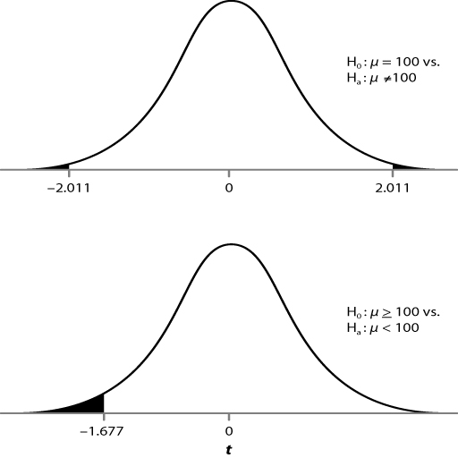

```{r setup, include=FALSE}
knitr::opts_chunk$set(echo = TRUE)
options("yaml.eval.expr" = TRUE)
```

# 2.4.Inferencias acerca de la Media de Una Población

Es usual preguntarnos sobre el valor de la media de una población, a partir de una muestra: ¿cuál es la concentración de nitrógeno en este lago? ¿cuál es el nivel de azúcar en la sangre de la población de Humacao?  En esta sección estaremos realizando pruebas de hipótesis acerca de la media y su intervalo de confianza, en una sola muestra.

## 2.4.1.La distribución t de Student   
#### Objetivos  
__Conocer la distribución _t_ y sus aplicaciones__  

Cuando no conocemos la desviación estándar de la población estudiada, la distribución de la media de las muestras, se desvía de la normalidad, especialmente cuando el tamaño de la muestra es pequeño.  En estos casos se utiliza la __distribución _t_ __, también conocida como ___t_ de Student.__  

### Grados de Libertad  
> Observaciones necesarias para determinar un parámetro estadístico

La distribución _t_ es similar a la distribución normal, excepto que está determinada por los __grados de libertad__(_gl_).  Los grados de libertad indican el número de observaciones independientes que pueden usarse para estimar un parámetro estadístico.  Un ejemplo es el cálculo de la media: el cálculo de la media incluye la suma de todos los valores de una muestra, por lo tanto si conocemos _n - 1_ valores y la media de los valores valores, podemos conocer el _enésimo_ valor desconocido, por lo tanto en cualquier cálculo de un estadístico que requiera la media de una muestra, debemos rebajar 1 al tamaño de la muestra para obtener los grados de libertad de ese estadístico.  

La siguiente gráfica nos muestra la dependencia de la distribución _t_ en el tamaño de la muestra, por lo tanto los valores de _t_ dependen de los grados de libertad _(n - 1)_ y de la probabilidad $\alpha$.  

```{r normal-t}
curve(dnorm(x), -4, 4, col = "red", ylab = "Densidad")
curve(dt(x, df = 2), col = "blue", add = TRUE)
curve(dt(x, df = 6), add = TRUE)
curve(dt(x, df = 12), add = TRUE)
```  
__Figura 1.__  Distribución normal estándar (roja) y distribución _t_ para grados de libertad = 2 (azul), 6, 12.

### Valores de la Distribución _t_  
> Valores de _t_ mediante tabla y las funciones __pt__ y __qt__ 

Usualmente la distribución _t_ se utiliza para encontrar valores críticos para un determinado valor de $\alpha$ (error tipo I), por ejemplo 0.05.  En la tabla [_t Table_](https://drive.google.com/file/d/1_em5NreF48RjHKJk0TUsoEhbrgeIroZC/view?usp=sharing) podemos encontrar valores de _t_ para algunos valores representativos de $\alpha$.  En esta tabla podemos determinar el valor crítico para una probabilidad a un lado u otro de la curva (__una cola__), o repartir la probabilidad entre ambos extremos de la curva (__dos colas__).  

#### __Ejemplo__  
Encontrar en la tabla el valor de _t_ para un $\alpha$ de 0.10 de dos colas, y para un $\alpha$ de 0.05 en la cola izquierda, para una muestra de 10 observaciones.  

Ahora utilizaremos las funciones que provee R:
```{r ptqt}
# valor de t alfa = 0.05 izquierda
qt(0.05, 9, lower.tail = TRUE)
# valor de t alfa = 0.05 derecha
qt(0.05, 9, lower.tail = FALSE)
# probabilidad con valor de t
pt(1.83311, 9,lower.tail = FALSE)
```

En las próximas secciones utilizaremos la distribución _t_ para calcular __intervalos de confianza__ y pruebas de hipótesis sobre la media de una población.

\

[  __Home__](https://dsfernandez.github.io/bioestadisticas/index.html)

## 2.4.2.Intervalo de Confianza para la Media  
#### Objetivos  
__Calcular intervalos de confianza para la media__  

Con una muestra, obtenida de una población que asumimos tiene una distribución normal de valores de alguna variable, podemos calcular el __intervalo de confianza__, dentro del cual tenemos cierto nivel de confianza (dado por la probabilidad establecida) de que se encuentra la media poblacional ($\mu$).  

A partir de una muestra obtenemos la media muestral ($\bar x$) y la desviación estándar de la muestra ($s$), y el error estándar de la media muestral ($s_{\bar x} = s / \sqrt n$).  Ahora podemos calcular el intervalo de confianza mediante las siguientes fórmulas:  
$$LS_{Pr} = \bar x + (t_{\alpha,n-1}*s_{\bar x})$$  
$$LI_{Pr} = \bar x - (t_{\alpha,n-1}*s_{\bar x})$$  
Donde: 

> $LS$: límite superior del intervalo de confianza  
> $LI$: límite inferior del intervalo de confianza  
> $Pr$: probabilidad dentro del intervalo de confianza  
> $\bar x$: media de la muestra  
> $t$: valor del estadístico t  
> $\alpha$: probabilidad fuera del intervalo (1 - Pr)  
> $n - 1$: grados de libertad (n, tamaño de la muestra)  
> $s_{\bar x}$: error estándar de la media muestral

#### __Ejercicio__  
Se colectó una muestra de 20 individuos de _Gambusia affinis_ (_mosquito fish_), y se les midió la longitud a cada uno.  La longitud media de la muestra ($\bar x$) fue 21.0 mm, y la desviación estándar de la muestra (_s_) fue 1.76 mm.  Queremos encontrar el intervalo de 95% de confianza para la media poblacional.  Asumimos que la longitud de los peces es una variable con distribución normal y que la muestra fue tomada al azar.  

A continuación el cálculo de los intervalos de confianza utilizando R; para el cálculo de la _t_ se usa una probabilidad de error $\alpha / 2$ debido a que por definición el intervalo de confianza es a ambos lados de la curva de distribución y es simétrico con respecto a la media.
```{r intconf}
# media de la muestra
media <- 21
# desviación estándar de la muestra
de <- 1.76
# tamaño de la muestra
n <- 20
# cálculo del error para el intervalo con alfa/2
# grados de libertad = n - 1
# error estándar = de/raíz cuadrada de n
error <- qt(0.025,df = n-1, lower.tail = FALSE)*de / sqrt(n)
# límite inferior (izquierdo) del intervalo
left <- media - error
# límite superior (derecho) del intervalo
right <- media + error
sprintf("Límite Inferior = %.2f", left)
sprintf("Límite Superior = %.2f", right)
```
La media de la población de encuentra dentro del intervalo 20.18 - 21.82, con una confianza de 95 %.  


\

[  __Home__](https://dsfernandez.github.io/bioestadisticas/index.html)

## 2.4.3.Hipótesis para la Media de una Muestra  
#### Objetivos  
__Realizar pruebas de hipótesis sobre una sola media__  

En general, una __prueba t para una muestra__ se utiliza para probar la hipótesis nula:  
$$H_0 : \mu = \mu_0$$
donde $\mu_0$ es algún número específico, pre-establecido, y una hipótesis alterna puede ser:  
$$H_a : \mu \neq \mu_0$$
Para probar la $H_0$ se utiliza el estadístico _t_, calculado ($t_s$) de la siguiente manera:  
$$t_s = \frac{\bar x - \mu_0}{\frac{s}{\sqrt n}}$$
Utilizando la tabla o funciones de R, calculamos el valor crítico de t ($t_{\alpha,n-1}$) para un valor establecido de $\alpha$, usualmente 0.05.  Si el valor $t_s$ excede al valor crítico, podemos rechazar $H_0$, para una probabilidad (error tipo I) igual o menor de $\alpha$. Por el contrario, un valor de $t_s$ menor que el valor crítico, no nos permite rechazar la $H_0$ para nuestro nivel de $\alpha$.  

### Pruebas de una o dos colas  
> Depende de nuestras hipótesis  

Les indiqué anteriormente que al usar la tabla de la distribución _t_, debemos escoger una cola o dos colas para ubicar el valor crítico.  La selección de una o dos colas, y en el caso de una cola, la parte de la curva, depende de las hipótesis establecidas.  Si las hipótesis no indican una tendencia (mayor o menor) en particular para el valor de la media, como se formularon anteriormente, entonces debemos utilizar una prueba de dos colas, y el valor de $\alpha$ se reparte entre los dos extremos como $\alpha / 2$.  Si por el contrario las hipótesis tienen esta forma:  
$$H_0 : \mu \geq \mu_0\quad ó\quad H_0 : \mu \leq \mu_0$$
$$H_a : \mu < \mu_0\quad ó\quad H_a : \mu > \mu_0$$
entonces debemos usar una prueba de una cola.

#### __Ejemplo__  


__Figura 2.__  Ejemplo para ilustrar la selección de prueba de una o dos colas.

#### __Ejercicio__  

Las reglas de la FDA exigen que los medicamentos cumplan con estrictos estándares de contenido de las sustancias activas de los mismos.  Para un suplemento vitamínico está establecido que el contenido de vitamina X sea de un promedio de 100 unidades por píldora.  Una bioquímica de la farmaceútica que las produce, toma una muestra de 50 píldoras de un lote de miles de píldoras. En su análisis encontró que la muestra tiene un contenido promedio de 100.5 unidades de vitamina X por píldora, con una desviación estándar de 2.19 unidades.  Desea comprobar si la muestra se tomo de una población (el lote completo) con una media de 100 unidades.  

Mediante R podemos calcular el valor del estadístico _t_ y compararlo con el de la distribución _t_ correspondiente para realizar la prueba de hipótesis $H_0:\mu=100$:
```{r infmedia}
# cálculo de t
tcalc <- (100.5 - 100) / (2.19 / sqrt(50))
# t de la distribución para alfa = 0.05 (dos colas) y gl = 49
ttab <- qt(0.025, 49, lower.tail = FALSE)
# mostrar valores
sprintf("t calculado para la muestra = %.3f", tcalc)
sprintf("t para la distribución con 49 g.l. = %.3f", ttab)
```

Por lo tanto, para nuestras condiciones, no podemos rechazar la hipótesis nula.  

\

[  __Home__](https://dsfernandez.github.io/bioestadisticas/index.html)

## 2.4.4.Prueba t Pareada
#### Objetivos  
__Probar hipótesis en experimentos de comparaciones pareadas__  

En el diseño de __comparaciones pareadas__ un sujeto experimental se empareja con otro lo más similar posible y, de manera aleatoria, a uno se le un tratamiento y al otro no o uno diferente.   El efecto de un tratamiento se mide mediante la diferencia entre los sujetos emparejados, por eso la prueba de hipótesis se realiza como de una muestra.  

### Supuestos de la prueba  
> Normalidad y muestra aleatoria  

* Las mediciones son continuas, o si son discretas tienen un ámbito amplio de valores.  
* La distribución de la variable de las diferencias entre los pares es normal.   
* Los datos son una muestra aleatoria de una población de interés.  

#### __Ejemplo__  
Vamos a analizar datos del tiempo de curación de quemaduras (días) utilizando dos preparaciones de un medicamento.  Los sujetos (_n_ = 20) fueron tratados de quemaduras en ambos brazos, un brazo con la versión O y el otro con la versión N del medicamento.
```{r datos-tpar, echo=FALSE}
library(kableExtra)
# datos
curacion <- read.csv("data/Table 9.2.csv")
names(curacion) <- c("paciente", "versión O", "versión N", "diferencia")
curacion %>%
  kbl(caption = "Tabla 1. Tiempo de curación (días) de quemaduras en brazos de pacientes (n = 20), tratados con sendas versiones (O y N) de un medicamento y la diferencia entre ambos") %>%
  kable_classic(full_width = F, html_font = "Cambria")
```

En primer lugar debemos formular las hipótesis de trabajo; en este experimento esperamos que la versión N del medicamento sea mejor que la versión O, por lo tanto el tiempo de curación debe ser menor y la diferencia N - O debe ser un número positivo. 
$$H_0 : \mu_{diferencia}  \leq 0$$  
$$H_0 : \mu_{diferencia}  > 0$$  

A partir de los datos anteriores podemos calcular la media de las diferencias y su desviación estándar: 
```{r echo=FALSE}
xdif <- mean(curacion$diferencia)
dedif <- sd(curacion$diferencia)
sprintf("Media de las diferencias (días) = %.3f", xdif)
sprintf("Desviación estándar de las diferencias (días) = %.3f", dedif)
```

Ahora calcularemos el valor del estadístico _t_ para nuestra muestra:  
$$t = \frac{2.685}{2.362\sqrt{20}} = 5.08$$

Utilizando la tabla de la _t_ de Student calculamos el valor crítico (umbral) de _t_ para un $\alpha$ = 0.05, y _n_ - 1 = 19 grados de libertad.  De acuerdo a nuestras hipótesis, la prueba debe ser de una cola.    También podemos utilizar la función correspondiente en R.  
```{r tumbral}
tumbral <- qt(0.05, 19, lower.tail = FALSE)
tcrit <- sprintf("%.2f", tumbral)
```

$t_{0.05,19} =$ `r tcrit`

El estadístico _t_ calculado es mayor que el valor crítico de _t_, por lo tanto rechazamos la $H_0$ con una probabilidad menor de 0.05 de equivocarnos (error tipo I).  La versión N del medicamento cura más rápidamente las quemaduras.

Utilizando R podemos realizar un análisis gráfico del experimento.
```{r grafpar, message=FALSE, warning=FALSE}
library(PairedData)
versionO <- curacion$`versión O`
versionN <- curacion$`versión N`
pd <- paired(versionO,versionN)
plot(pd, type = "profile") + ylab("Tiempo de curación, días")
```

__Figura 3.__  Tiempo de curación (días) para dos versiones de un medicamento.  Box-plot de los valores de cada versión y líneas de conexión de los sujetos pareados.  

La prueba _t_ pareada también se puede hacer a partir de los datos originales:
```{r pairt}
res <- t.test(versionO, versionN, paired = TRUE, alternative = "greater")
res
```


\  

[  __Home__](https://dsfernandez.github.io/bioestadisticas/index.html)

## 2.4.5.Supuestos y Pruebas No-paramétricas  
#### Objetivos  
__Conocer las alternativas cuando no se cumplen los supuestos para usar una prueba _t_ __  

Los supuestos principales para las __pruebas paramétricas__ (basadas en la distribución normal y sus parámetros, $\mu$ y $\sigma$) de una muestra, son la aleatoriedad de la muestra y la normalidad en los datos.  Si no se cumple la primera, no hay alternativa, pero en el caso de fallar la normalidad, podemos usar __pruebas no_paramétricas__.  

### Prueba de Wilcoxon (_Wilcoxon Signed Rank Test_)    
> Alternativa a la prueba _t_ pareada  

Cuando los datos no cumplen con el supuesto de normalidad, o las muestras no son suficientemente grandes para obviar ese supuesto, podemos recurrir a pruebas no_paramétricas como sustituto a la prueba _t_ pareada.  La __prueba de Wilcoxon__ es un ellas, y consiste en colocar en orden (usualmente de menor a mayor) los resultados (valores absolutos) de las diferencias entre los valores pareados.  Luego se suman los valores de rango de las diferencias positivas y de las diferencias negativas, y se aplica la fórmula:  
$$W = \sum_{i=1}^{N_r}[sgn(x_{2,i} - x_{1,i})*R_i]$$
dónde:  

> $W$: estadístico de Wilcoxon  
> $N_r$: tamaño de la muestra, excluyendo parejas con valores iguales  
> $sgn$: función signo (extrae el signo de la diferencia)  
> $x_{2,i} - x_{1,i}$: diferencia entre parejas de valores  
> $R_i$: rango (orden) de las diferencias  

El valor calculado se compara con un valor crítico de W para una probabilidad establecida.

Los cálculos para usar la fórmula y realizar la prueba correspondiente son algo engorrosos, pero disponemos de procedimientos computacionales, como R, para realizarlos.  

#### __Ejemplo__  
Se piensa que las gatas se vuelven más agresivas al tener gatitos.  En un experimento se evaluó la agresividad de 7 gatas antes y después de que parieran.  La agresividad se midió mediante una escala entre 1 y 10, con 10 representando la mayor agresividad.  Estos datos no cumplen con la distribución normal y son pocos para obviar este requerimiento.  Queremos probar la hipótesis de si hay un aumento de la agresividad ($H_a:diferencia\ en\ agresividad > 0$).  

```{r gatas}
library(kableExtra)
# vector agresividad x1
x1 <- c(3,2,5,6,5,1,8)
# vector agresividad x2
x2 <- c(7,8,4,9,10,9,9)
# vector diferencia x2 - x1
dif <- x2 - x1
# tabla de datos
gatas <- data.frame(x1,x2,dif)
# ver tabla
names(gatas) <- c("Agresividad antes", "Agresividad después", "Diferencia")
gatas %>%
  kbl(caption = "Tabla 2. Agresividad antes y después de parir en gatas (n = 7) y la diferencia después - antes") %>%
  kable_classic(full_width = F, html_font = "Cambria")
```
Realizaremos la prueba para una $H_0 : diferencia \leq 0$ mediante R:
```{r wilcsgn, message=FALSE, warning=FALSE}
# prueba Wilcoxon (estado final x2, estado inicial x1)
res <- wilcox.test(x2, x1, paired = TRUE, alternative = "greater")
res
```

Podemos concluir de la prueba que podemos rechazar la $H_0$ con un error tipo I de 0.021, y que las gatas son más agresivas después de parir. 

[  __Home__](https://dsfernandez.github.io/bioestadisticas/index.html)


