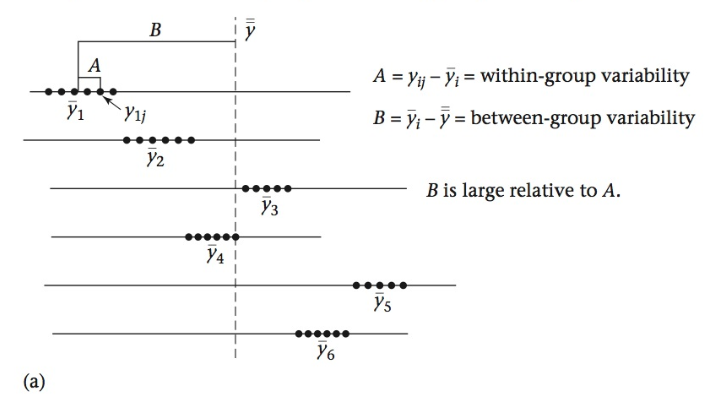

```{r setup, include=FALSE}
knitr::opts_chunk$set(echo = TRUE)
options("yaml.eval.expr" = TRUE)
```

# 3.1.Análisis de Varianza  
> Inferencias sobre las medias de varias poblaciones   

En el tema anterior estuvimos haciendo comparaciones de medias entre dos muestras; frecuentemente, sin embargo, necesitamos comparar las medias de más de dos muestras.  La metodología estadística utilizada comúnmente para estos casos, es el __análisis de varianza__ (ANOVA).

El análisis de varianza es la herramienta usualmente utilizada cuando queremos analizar el efecto de diferentes __grupos__ (una variable categórica) en una variable medida (__respuesta__).  La técnica del ANOVA es útil tanto para __diseños experimentales__, como para __observaciones__ o __encuestas__.  La hipótesis nula para este tipo de análisis, para el caso de que tengamos tres grupos, es:  
$$H_0 : \mu_A = \mu_B = \mu_C$$
Ahora bien, podemos preguntarnos por qué no usamos múltiples pruebas _t_, y descomponemos la hipótesis anterior en tres hipótesis nulas.  En primer lugar, no es práctico si tenemos muchos grupos.  Por ejemplo, con cuatro grupos, usando la fórmula de combinaciones, tendríamos seis parejas de $H_0$ para probar, con ocho grupos tendríamos ¡28!  En segundo lugar, al realizar múltiples pruebas _t_ el __error tipo I__ se va incrementando al aumentar el número de pruebas.  El ANOVA supera ambos problemas.  

## 3.1.1.Fundamentos del ANOVA  
#### Objetivos  
__Conocer los fundamentos teóricos y supuestos para realizar el análisis de varianza__  

Vamos a considerar, de acuerdo a la hipótesis nula anterior, que las muestras provienen de una misma población, y por tanto las medias muestrales representan la media poblacional.  

Tenemos el siguiente modelo para describir el valor de cualquier observación, proveniente de varios grupos ($n_i, i=1...k$), cada uno con $n_{ij}$ observaciones:  
$$y_{ij} = \mu + \delta_i + e_{ij}$$

donde:

> (1) $\mu$ representa la media de todas las mediciones de todos los grupos.
> (2) $\delta_i$ representa la diferencia entre la media del grupo $n_i$ y la media de todos los grupos, $\mu$.
> (3) $e_{ij}$ representa el error aleatorio alrededor de los valores $\mu + \alpha_i$, de una observación del grupo $n_i$.  

### Las Fuentes de Variación para el Análisis de la Varianza 
> Variabilidad Dentro de Grupos, Variabilidad Entre Grupos, Variabilidad Total

A partir del modelo anterior, podemos rearreglar los términos para diferencias las fuentes de variación que se van a comparar en el análisis de varianza para probar la hipótesis nula de igualdad de las medias de las muestras:  
$$y_{ij} - \bar{\bar y} =  (\bar y_i - \bar{\bar y}) + (y_{ij} - \bar y_i)$$

donde:

> $y_{ij} - \bar{\bar y}$, representa la desviación de una medición con respecto a la media global, o _variabilidad total._  
> $\bar y_i - \bar{\bar y}$, representa las desviación de la media de un grupo con respecto a la media global, y es un indicador de la _variabilidad entre grupos_ o _varianza del tratamiento_.  
> $y_{ij} - \bar y_i$, representa la desviación de una medición con respecto a la media de su grupo, y que se conoce como la _variabilidad dentro de grupo_ o _varianza del error_.      
  
### Relación entre Fuentes de Variación y la Hipótesis Nula  
> Cómo la variabilidad (varianza) permite probar hipótesis sobre las medias  

En la ecuación anterior, el término de variabilidad entre grupos debe ser muy cercano a cero para que se compruebe la $H_0$ de igualdad de las medias de las muestras.  Podemos visualizar este planteamiento de la siguiente forma:  

  
__Figura 1a.__ Distribución de la variabilidad dentro (_A_) y entre grupos (_B_).  _B_ es mucho mayor que _A_ ($\delta_i \neq 0$), indicando que al menos una de las muestras no proviene de la misma población de valores.  

  
__Figura 1b.__  Distribución de la variabilidad dentro (_A_) y entre grupos (_B_).  _B_ es pequeño en comparación con _A_ ($\delta_i \approx 0$), indicando que se cumple la $H_0$ de muestras que provienen de una misma población de valores.  

### La Distribución _F_  
> Probando la hipótesis nula mediante una distribución para la probabilidad de error tipo I.  

Para evaluar la hipótesis nula ($H_0:\mu_A = \mu_B = \mu_C = et c.$), debemos comparar la varianza del tratamiento (__entre grupos__) con la varianza del error (__dentro de grupos__), utilizando un estadístico de razón o proporción, denominado _F_, y que se calcula para el análisis de varianza como:  
$$F = \frac{varianza\ entre\ grupos}{varianza\ dentro\ grupos} = \frac{MS_{entre}}{MS_{dentro}}$$  
donde:  

> $MS_{entre}$ = media de la suma de cuadrados entre grupos  

> $MS_{dentro}$ = media de la suma de cuadrados dentro de grupos  

Estos estadísticos son una medidad de las respectivas varianzas, y su cálculo se detalla más adelante.  La distribución de probabilidades de la razón anterior, se denomina __distribución _F_ __, y se utiliza para pruebas de hipótesis como se usan la distribución _t_ y $\chi^2$.   

Cuando los tratamientos (grupos) no tienen efecto en la respuesta, la varianza en el conjunto de los datos será similar a la varinza dentro de cada grupo; en este caso la razón que se calcula para el estadístico _F_ será cercana a 1.0.  Por el contrario, cuando hay un efecto importante de uno o más tratamientos, entonces _F_ >> 1.

### Obtención del Valor Crítico de _F_  
> A partir de la tabla o mediante R  

Una vez que obtenemos el valor del estadístico _F_, calculado con los datos, debemos compararlo con el valor correspondiente a un nivel $\alpha$, usualmente 0.05, con los respectivos grados de libertad.  La distribución _F_ depende de dos tipos de grados de libertad:  
$$gl_{entre} = k - 1$$   
_k_: número de grupos
$$gl_{dentro} = n - k$$  
_n_: número total de mediciones  

  
__Figura 2.__ Diagrama de la distribución _F_, mostrando la región de rechazo de la $H_0$, $\alpha$. 

Con la [Tabla de la Distribución _F_](https://drive.google.com/file/d/1NAnlk4PMiPgof4suSOBxY58inOT1B2Kt/view?usp=sharing) podemos calcular el valor crítico de _F_ para un nivel $\alpha$ (o _p_), y los grados de libertad del numerador (_k - 1_), y del denominador (_n - k_) del estadístico _F_.  

El valor crítico de _F_ lo podemos obtener utilizando la función __qf__, o podemos obtener la probabilidad para un valor de _F_ usando __pf__.  Las funciones calculan los valores de probabilidades a la izquierda del valor _F_.
```{r F}
# valor crítico de F para valores de alfa, glNum, glDenom
alfa <- 0.05
glnum <- 5
glden <- 2
fcrit <- qf(1 - alfa, df1=glnum, df2=glden)
# probabilidad para un valor de F
fval <- 19.3
pizq <- pf(fval, df1=glnum, df2=glden)
sprintf("Valor de F_alfa,gln,gld = %.3f", fcrit)
sprintf("Probabilidad a la izquierda de F = %.3f", pizq)
```


\

[  __Home__](https://dsfernandez.github.io/bioestadisticas/index.html)

## 3.1.2.ANOVA de Una Vía con Efectos Fijos  


[  __Home__](https://dsfernandez.github.io/bioestadisticas/index.html)

## 3.1.3.Comparaciones Múltiples


[  __Home__](https://dsfernandez.github.io/bioestadisticas/index.html)

## 3.1.4.Supuestos para el ANOVA y Alternativas

 

[  __Home__](https://dsfernandez.github.io/bioestadisticas/index.html)

## 3.1.5.Otros Diseños de ANOVA

efectos aleatorios
ANOVA con dos factores
ANOVA con repeticiones
ANCOVA
 

[  __Home__](https://dsfernandez.github.io/bioestadisticas/index.html)

