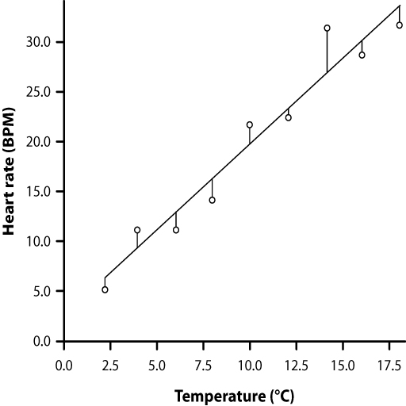

```{r setup, include=FALSE}
knitr::opts_chunk$set(echo = TRUE)
options("yaml.eval.expr" = TRUE)
```

# 3.3.Análisis de Regresión  

En el análisis de regresión se busca un modelo para describir estadísticamente la relación entre una __variable dependiente__ y otra (u otras) __independiente__.  El modelo es una ecuación matemática que "cuantifica" la relación entre las variables.  A la variable dependiente también se le llama __variable respuesta__ (y se grafica en el eje _Y_) y a la variable independiente también se la conoce como __variable predictora__ o __explicativa__.  

A diferencia del análisis de correlación, en el análisis de regresión se asume una __relación causa-efecto__ en la que las variaciones en la variable predictora causan cambios en la variable respuesta.  

#### __Ejercicio__  
Escribir ejemplos de posibles relaciones causa-efecto entre dos variables, indicando cuál es la variable respuesta y cuál la predictora.

## 3.3.1.Fundamentos de la Regresión Lineal Simple
#### Objetivos  
__Formalizar el modelo y los supuestos de la regresión lineal simple__  

Una __regresión lineal simple__ modela el efecto de una variable predictora continua sobre una variable de respuesta continua. La __ecuación de regresión__ resultante se puede representar gráficamente como una __línea de regresión__, que representa los valores esperados de la variable de respuesta para todos los valores de la variable predictora.

En la regresión lineal simple, la relación funcional entre la variable dependiente (_y_) y la independiente (_x_) se representa:  
$$\mu_y = \alpha + \beta x$$

donde:  

> $\mu_y$: es la media poblacional de _y_ para cualquier valor de _x_,    
> $\alpha$: es el __intercepto__ y  
> $\beta$: es la __pendiente__.  

Esta ecuación describe una línea recta.  En forma estadística esta ecuación toma la forma:  
$$y_i = \alpha + \beta x + e_i$$  
donde el término $e_i$ indica la desviación aleatoria o __residual__ del valor de $y_i$ con respecto al valor esperado $\mu_y$.  

### Objetivos del Análisis de Regresión  

1. Estimar la ecuación de regresión mediante estimadores de $\alpha$ (_a_) y $\beta$ (_b_) a partir de una muestra y generar intervalos de confianza para los mismos.  
2. Estimar que tanto está la variable dependiente controlada por la variable independiente, en otras palabras que tanto la variación en _y_ se explica por la variación en _x_.  
3. Usar la ecuación de regresión para predecir valores de _y_ a partir de valores de _x_. 

### Supuestos del Análisis de Regresión  
Como en todo análisis estadístico paramétrico, la regresión lineal simple posee algunos supuestos:  

1. Las observaciones son independientes, lo cual implica que cada sujeto en una muestra solo se mide una vez: no puede haber pseudoreplicación.    
2. Se asume que la relación entre las dos variables es lineal.  
3. Los residuales ($e_i$) alrededor de la línea de regresión tienen una distribución normal estándar ($\mu = 0$).  
4. La varianza de los residuales es igual para todos los valores de _x_ de los datos.  Esto es equivalente a la homogeneidad de varianza en el ANOVA.  

\

[  __Home__](https://dsfernandez.github.io/bioestadisticas/index.html)

## 3.3.2.Parámetros de la Regresión
#### Objetivos
__Calcular y probar hipótesis sobre los estimadores de los parámetros de la regresión lineal simple__  

### Método de los Cuadrados Mínimos (_Least Squares_)  

El primer objetivo del análisis de regresión, encontrar los valores de _a_ y _b_ de la ecuación de la recta, requiere un procedimiento matemático para encontrar la "mejor" línea recta que pase por los puntos $(x_i,y_i)$ de las variables respuesta y predictora.  Comunmente se utiliza el método de los __cuadrados mínimos ('least squares')__, el cual consiste en encontrar el mínimo valor de esta expresión:  
$$\sum_{i=1}^n (y_i - \hat{y_i})^2$$
es decir el mínimo valor de la suma de las diferencias verticales de la _y_ de cada punto y la _y_ sobre una línea de regresión, elevada al cuadrado (Figura 1).  

  
\
__Figura 1.__ Ritmo cardíaco (BPM) en función de la temperatura corporal (ºC) en pitones. Línea con la menor distancia vertical a los puntos de la muestra ($y_i - \hat{y_i}$).  

### Cálculos del Coeficiente de Regresión (_b_) y el Intercepto en el eje Y (_a_)
Para el cálculo de los estimadores de $\alpha$ y $\beta$, según el método de los cuadrados mínimos, se necesitan las siguientes cantidades:  

__Suma de Cuadrados de la Variable Predictora, $\sum x^2$__  
(todas las sumatorias son de _i_ = 1 hasta _n_, número de puntos)  
$$\sum(X_i - \bar X)^2 = \sum X_i^{2} - \frac{(\sum X_i)^2}{n}  $$

__Suma de Productos Cruzados, $\sum xy$__
$$\sum(X_i - \bar X)(Y_i - \bar Y) = \sum X_iY_i - \frac{(\sum X_i)(\sum Y_i)}{n}$$
El __coeficiente de regresión__ (parámetro $\beta$) es la pendiente de la __línea de regresión__ y su estimador (_b_) es el siguiente:  
$$b = \frac{\sum xy}{\sum x^2}$$
Para calcular el estimador de $\alpha$, _a_, utilizamos el estimador _b_ y las medias de _x_ y _y_ (que por deducción matemática, están en la recta de regresión):
$$a = \bar Y - b\bar X$$

\  

[  __Home__](https://dsfernandez.github.io/bioestadisticas/index.html)


#### __Ejemplo 1__  
Vamos a usar los datos de la longitud (cm) del ala derecha de gorriones de diferentes edades (días).  En este caso, podemos asumir que la variable dependiente es la longitud del ala y la independiente, la edad de las aves.  
```{r gorriones}
edad <- c(3.0,4.0,5.0,6.0,8.0,9.0,10.0,11.0,12.0,14.0,15.0,16.0,17.0)
l.ala <- c(1.4,1.5,2.2,2.4,3.1,3.2,3.2,3.9,4.1,4.7,4.5,5.2,5.0)
sparrow <- data.frame(edad,l.ala)
#tabla de datos
knitr::kable(sparrow, col.names = c("Edad (días)", "Longitud ala (cm)"), caption = 'Tabla 1.  Longitud del ala derecha de gorriones de diferente edad') 
#gráfica x-y
plot(edad,l.ala,xlab = "Edad, días", ylab = "Longitud, cm")
```
\
__Figura 2.__ Gráfica de los datos de la Tabla 1, longitud del ala de gorriones (variable dependiente) y edad (variable independiente).  

Observando la Figura 2 podemos sospechar que hay una posible relación entre la longitud del ala y la edad.  A continuación calcularemos los estadísticos que necesitamos para obtener los estimadores de los parámetros de la ecuación de regresión lineal para las variables de esta muestra.  

### Cálculo Manual

```{r calcab}
#tamaño muestra
n <- length(l.ala)
#medias
X <- mean(sparrow$edad)
Y <- mean(sparrow$l.ala)
#sumatorias
sumX <- sum(sparrow$edad)
sumY <- sum(sparrow$l.ala)
sumX2 <- sum(sparrow$edad^2)
sumXY <- sum(sparrow$edad*sparrow$l.ala)
#suma de cuadrados
SSx2 <- sumX2 - (sumX^2)/n
Sxy <- sumXY - (sumX*sumY)/n
#cálculo de b
est.b <- Sxy/SSx2
# cálculo de a  
est.a = Y - est.b*X
```

__Resultados parciales__  
$\sum x_i$ = `r sumX`  
$\sum y_i$ = `r sumY`  
$\sum {x_i}^2$ = `r sumX2`  
$\sum x_i y_i$ = `r sumXY`    
$\sum x^2$ (suma de cuadrados) = `r SSx2`  
$\sum xy$ (suma de productos cruzados) = `r Sxy`    

__Coeficiente de Regresión (_b_)__    
$b$ = `r est.b`  

__Intercepto en Y (_a_)__    
$a$ = `r est.a`  

__Ecuación de la recta de regresión__  
```{r echo=FALSE, message=FALSE, warning=FALSE}
sprintf("Y = %.3f + %.3fX", est.a, est.b)
```

### Cálculo de Coeficientes con R
Para obtener los coeficientes de la recta de regresión, usamos la función __lm__ (_linear models_) en R.
```{r lmreg}
regr <- lm(l.ala ~ edad)
coefficients(regr)
```
### Gráfica de la línea de regresión lineal

```{r}
plot(edad,l.ala, xlab = 'Edad, días', ylab = 'Longitud del ala, cm', asp = 1)
abline(regr, col = 'blue')
```
\
__Figura 3.__ Línea de regresión para la relación entre la longitud del ala (cm) y la edad (días) de gorriones.

\  

[  __Home__](https://dsfernandez.github.io/bioestadisticas/index.html)

## 3.3.3.Pruebas de Hipótesis y Evaluación de la Regresión
__Realizar pruebas de hipótesis sobre los coeficientes de la regresión y el cumplimiento de los supuestos__  

Una vez obtenida la ecuación de regresión, nos interesa saber cuál es su significancia en contraste con la hipótesis nula:  
$$H_0:\beta = 0$$    
Por otra parte, es importante cuantificar qué tan bien el modelo de regresión (línea recta) predice _y_ a partir de _x_; para esto calcularemos el __coeficiente de determinación__ ($\mathbf{r^2}$).  

Y finalmente, debemos determinar si las variables cumplen los supuestos para aplicar el análisis de regresión paramétrico.  

### Significancia de la Ecuación de Regresión  

Para probar el modelo de regresión utilizamos el estadístico _F_, de manera similar a lo hecho en el ANOVA, utilizando los cuadrados medios (_MS_) equivalentes.  Como no tenemos grupos (tratamientos), en lugar de la suma de cuadrados dentro de grupos ($SS_{within}$), utilizamos como equivalente los __residuales__ (___residual SS___).  A partir de la diferencia de cada valor de _y_ con la media $\bar y$ global, calculamos la suma de cuadrados total (___total SS___).  El equivalente a la suma de cuadrados entre grupos es la suma de cuadrados de la regresión (___regresión SS___).

#### __Fórmulas para los cálculos de sumas de cuadrados:__  

__Suma de Cuadrados de _y_ o Total $\sum y^2$:__  
$$total\ SS = \sum y_i{^2} - \frac{(\sum y_i)^2}{n}$$

__Suma de Cuadrados de la Regresión:__
$$regresión\ SS = \frac{(\sum x_iy_i)^2}{\sum x{_i}^2} = b\sum x_iy_i$$

__Suma de Cuadrados de Residuales:__
$$residual\ SS = total\ SS - regresión\ SS$$

#### __Cuadrados medios y estadístico _F___  
Para calcular los cuadrados medios necesitamos conocer los grados de libertad (_gl_).  En el análisis de regresión estos son los siguientes:  

> _gl total_ = _N_ - 1  (_N_, cantidad de pares $x_i,y_i$)  
> _gl regresión_ = 1 (por tratarse de una sola variable independiente)  
> _gl residual_ = _N_ - 2  

Los cuadrados medios (_MS_) que necesitamos para calcular _F_:  
$$regresión\ MS = \frac{regresión\ SS}{gl\ regresión}$$  
$$residual\ MS = \frac{residual\ SS}{gl\ residual}$$
El estadístico _F_:  
$$F_{calculado} = \frac{regresión\ MS}{residual\ MS}$$
  
Para completar la prueba, obtenemos el valor crítico de _F_, para un nivel de significancia $\alpha$ y con los grados de libertad del numerador ($\nu_1$ = _gl regresión_) y del denominador ($\nu_2$ = _gl residual_).  Podemos utilizar la [Tabla de Valores Críticos de F](https://drive.google.com/file/d/1NAnlk4PMiPgof4suSOBxY58inOT1B2Kt/view?usp=sharing) o la función __qf__ en R (con _lower.tail_ = FALSE).  

#### __Resumen de cálculos__  

__Tabla 2:__ Resumen de cálculos para la prueba de hipótesis del coeficiente de regresión _b_.  
```{r prueba, echo=FALSE, message=FALSE, warning=FALSE}
library(dplyr)
library(kableExtra)
tabla2 <- data.frame(
  Fuente.de.Variacion = c("Total", "Regresión", "Residual"),
  SS = c("total SS", "regresión SS", "residual SS"),
  GL = c("n - 1", "1", "n - 2"),
  MS = c(" ", "reg.SS/reg.GL","res.SS/res.GL")
)
kable(tabla2) %>%
  kable_styling(full_width = F) %>%
  column_spec(1, bold = T, border_right = T) %>%
  column_spec(2:4, width = "10em", background = "orange")
```

\

#### __Ejercicio 1__  

Con los datos del Ejemplo 1 vamos a calcular el estadístico _F_ para probar la $H_0$, y si la rechazamos aceptaremos como significativo para $\alpha$ = 0.05, el valor de _b_ = 0.270.  

### Cálculo manual  
```{r calcman}
edad <- c(3.0,4.0,5.0,6.0,8.0,9.0,10.0,11.0,12.0,14.0,15.0,16.0,17.0)
l.ala <- c(1.4,1.5,2.2,2.4,3.1,3.2,3.2,3.9,4.1,4.7,4.5,5.2,5.0)
n <- length(edad)
reg1 <- lm(l.ala ~ edad)
coe <- as.matrix(coefficients(reg1))
b <- coe[2,1]
#Total SS
TotalSS <- sum(l.ala^2) - (sum(l.ala)^2)/n
#Regresión SS
RegresSS <- b*(sum(l.ala*edad)-(sum(edad)*sum(l.ala))/n)
#Residual SS
ResidualSS <- TotalSS - RegresSS
#MS
RegresMS <- RegresSS/1
ResidualMS <- ResidualSS/(n-2)
#tabla fuentes de variaciones
SS <- c(TotalSS, RegresSS, ResidualSS)
GL <- c(n-1, 1, n-2)
MS <- c(" ", RegresMS, ResidualMS)
tabla2 <- data.frame(
  Fuente.de.Variacion = c("Total", "Regresión", "Residual"),
  SS, GL, MS)
kable(tabla2) %>%
  kable_styling(full_width = F) %>%
  column_spec(1, bold = T, border_right = T) %>%
  column_spec(2:4, width = "10em", background = "orange")
#Fs
Fcalc <- RegresMS/ResidualMS
Ftabla <- qf(.05,1,n-2, lower.tail = FALSE)
```

$F_{calculado}$ = `r Fcalc`  

$F_{0.05,\nu_1=1,\nu_2=11}$ = `r Ftabla`

En conclusión, al encontrar que $F_{calculado} > F_{0.05,1,11}$, podemos rechazar la hipótesis nula de que $\beta$ = 0, y por lo tanto nuestro modelo muestra una relación significativa entre la longitud del ala y la edad de los gorriones.

\

[  __Home__](https://dsfernandez.github.io/bioestadisticas/index.html) 

### Intervalo de Confianza para $\beta$  
El coeficiente de regresión _b_ es un estimador del parámetro $\beta$, que no conocemos, pero podemos calcular un intervalo de confianza alrededor de _b_ en el que pudiera encontrarse con cierta probabilidad.  Para esto debemos primero calcular el __error estándar__ para _b_, $s_b$.  
$$s_b = \sqrt \frac{residual\ MS}{\sum x_i^2 - \frac{[\sum x_i]^2}{n}}$$  

Todos los valores necesarios para el cálculo de $s_b$ ya los tenemos del cálculo de _b_ y su prueba de significancia.  La fórmula para el intervalo de confianza requiere obtener un valor del estadístico _t_ para el nivel de confianza requerido (p. ej.: 95%):  
$$b \pm s_b*t_{\alpha,n-2}$$
Para nuestro ejemplo:  

_residual MS_ = `r ResidualMS`  

$\sum x_i^2$ = `r sumX2`  

$\sum x_i$ = `r sumX`

$$s_b = \sqrt \frac{0.0477}{1562 - \frac{[130]^2}{13}} = 0.01349$$
$$t_{0.05,11} = 1.7959$$
El intervalo de confianza 95% para $\beta$:  
$$0.2458 \leq \beta \leq 0.2942$$

### Coeficiente de Determinación  
El estadístico $r^2$ nos permite conocer cuál es la proporción de la varianza en _y_ que es explicada por su dependencia en _x_.  A $r^2$ también se lo conoce como __ajuste al modelo__ y su valor va de 0 a 1, con 1 como ajuste completo de los datos al modelo.  El coeficiente de determinación se calcula:  
$$r^2 = \frac{regresión\ SS}{total\ SS}$$
Para nuestro ejemplo, y con los valores calculados anteriormente:  
$$r^2 = \frac{19.132}{19.657} = 0.973$$
Es decir que el modelo explica el 97.3% de la variación de _y_ con su dependencia de _x_.  

### Cálculos con R  
La función __lm__ en R nos provee también los estadísticos y valores de probabilidad para probar hipótesis sobre el modelo de regresión lineal.  
```{r}
regrtest <- lm(l.ala ~ edad, data = sparrow)
summary(regrtest)
```

### Cumplimiento de los Supuestos  

El análisis de regresión, al igual que el ANOVA son bastantes robustos y permiten cierta desviación de los supuestos, en particular cuando se tiene un buen número de datos (por encima de 30 para algunos casos).  El supuesto de normalidad de las variables se puede comprobar con la prueba de Shapiro-Wilk, y una desviación o no de la linealidad en la relación se puede detectar visualmente; la Figura 2 en nuestro ejemplo, muestra una aparente relación lineal.  

Es más crítico probar la normalidad de los residuales y su homogeneidad de varianza.  A continuación usaremos gráficas de los residuales, obtenidos del modelo de regresión usando la función __lm__ en R.

```{r}
# q-q plot de residuales
plot(regr, 2)
```
__Figura 4.__ Gráfica Q-Q de los residuales.  

En la Figura 4 se pueden observar desviaciones de la normalidad (línea punteada).  Esta situación podría corregirse aumentando la cantidad de observaciones.  

```{r}
# homocedasticidad residuales
plot(regr, 3)
```

__Figura 5.__ Raíz cuadrada de los residuales estandarizados del modelo en función de los valores ajustados de _y_.  La línea roja muestra la tendencia de los puntos.

En la gráfica de la Figura 5 aunque no parece ocurrir una desviación importante del supuesto de homogeneidad de varianza de los residuales, ya que se distribuyen de forma homogénea alrededor de la línea de tendencia, sin embargo esta debería ser horizontal.  

Para tratar de corregir estas desviaciones de los supuestos se pueden realizar transformaciones de los datos, al igual que se indicó en detalle para el ANOVA.

\

[  __Home__](https://dsfernandez.github.io/bioestadisticas/index.html)


## 3.3.4.Predicción de _y_ a partir de _x_ usando la ecuación de regresión  
#### Objetivos  
__Estimar un valor de _y_ a partir de un valor de _x_ y su intervalo de confianza, usando la ecuación de regresión__  
 

[  __Home__](https://dsfernandez.github.io/bioestadisticas/index.html)

## 3.3.5.Otras Técnicas de Regresión

  

[  __Home__](https://dsfernandez.github.io/bioestadisticas/index.html)
